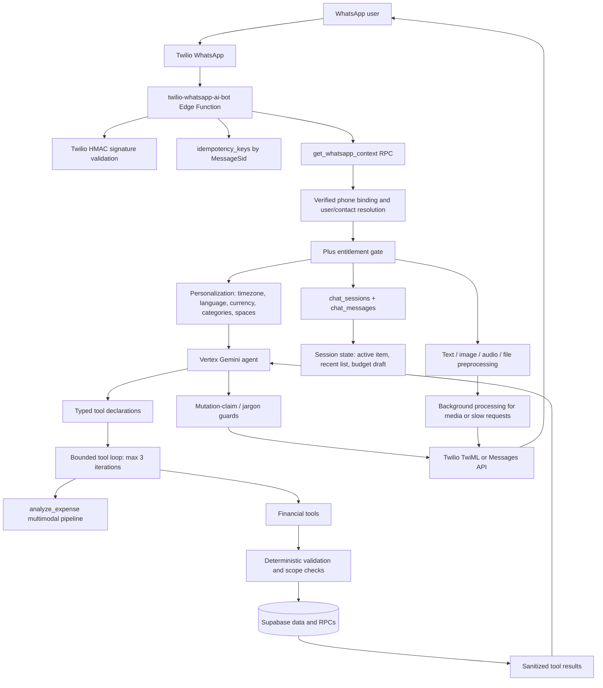

# WhatsApp AI Financial Assistant: Interview Engineering Audit

## Executive Summary

This is not a basic "WhatsApp text in, Gemini text out" integration. The verified implementation is a constrained financial agent:

```text
Twilio WhatsApp webhook
-> signature validation + MessageSid idempotency
-> phone-to-user resolution + verified binding + Plus entitlement
-> persisted chat history + scoped session state + user preferences
-> Vertex Gemini with typed financial tools
-> bounded tool-execution loop
-> deterministic validation, authorization, financial queries/writes
-> sanitized tool results back to Gemini
-> guarded final response + Twilio delivery / async fallback
```

Primary orchestration evidence: `supabase/functions/twilio-whatsapp-ai-bot/index.ts`.

## Actual Architecture



## Verified AI Capability Inventory

| Feature                                 | What it does                                                                                                                            | Why it is notable                                                                                      | Evidence                                                                                                                                                         | Classification                           | Tier |
| --------------------------------------- | --------------------------------------------------------------------------------------------------------------------------------------- | ------------------------------------------------------------------------------------------------------ | ---------------------------------------------------------------------------------------------------------------------------------------------------------------- | ---------------------------------------- | ---- |
| Tool-calling financial agent            | Lets Gemini choose financial operations rather than only generate prose.                                                                | The model plans actions, tools perform them, then results return to the model for a grounded response. | Tool registry: `twilio-whatsapp-ai-bot/index.ts:3088-3140`; loop: `:3394`; Vertex function-call support: `shared/vertex-ai-chat.ts:294-315`.                     | Agent Engineering, AI Engineering        | S    |
| Bounded multi-step execution            | Supports multiple tool turns in a request, capped at three loops.                                                                       | Prevents unbounded agent behavior while allowing workflows such as write then financial summary.       | `twilio-whatsapp-ai-bot/index.ts:3298-3307`, `:3394`, `:5100-5129`.                                                                                              | Agent Engineering, Reliability           | S    |
| Deterministic financial insight routing | Forces aggregate questions toward `financial_insight`, not row listing or LLM arithmetic.                                               | Keeps totals database-derived and prevents invented balances.                                          | `shared/bot/financial-insight-intent.ts:6-11`, `:69-130`; executor: `shared/bot/financial-insight-tool.ts:147`.                                                  | AI Engineering, Backend Engineering      | S    |
| Hallucinated-write prevention           | Blocks or repairs text that claims an action succeeded without a successful tool invocation.                                            | This is an explicit post-model guardrail, not prompt-only safety.                                      | Prompt: `shared/bot/system-instruction.ts:48-50`; repair: `twilio-whatsapp-ai-bot/index.ts:3320-3390`; final guard: `shared/bot/response-finalization.ts:40-98`. | AI Safety, Agent Engineering             | S    |
| Multimodal transaction extraction       | Processes WhatsApp receipt images, voice notes, PDFs, CSV/XLSX, and text into transaction candidates.                                   | Handles real-world financial inputs, not just chat text.                                               | WhatsApp media dispatch: `twilio-whatsapp-ai-bot/index.ts:3408-3573`; pipeline: `shared/analyze-core.ts:5259`, `:5560-6243`.                                     | Multimodal AI, Product Engineering       | A    |
| Structured transaction extraction       | Gemini returns `add_transactions` arguments for type, amount, category, currency, date, merchant, payer, and splits.                    | Uses constrained tool output instead of parsing free-form model prose.                                 | Schema: `shared/analyze-core.ts:5379-5500`; item shape: `:2152-2170`.                                                                                            | AI Engineering, Agent Engineering        | A    |
| Hybrid deterministic + AI parsing       | CSV/XLSX use deterministic parsers first; PDFs use dedicated parsing; LLM fallback is used only if required.                            | Uses deterministic code for structured input and LLMs for ambiguity.                                   | `shared/analyze-core.ts:5633-5744`, `:5799-5869`.                                                                                                                | AI Engineering, Reliability              | A    |
| Evidence-grounded extraction            | Validates extracted amounts, currency, merchant, and transaction time against source text.                                              | Reduces unsupported model extraction before persistence.                                               | `validateTransactionSourceGrounding`: `shared/analyze-core.ts:753-821`; currency evidence rules: `:6093-6096`.                                                   | AI Safety, Reliability                   | A    |
| Household split verifier                | A second independent AI decision verifies non-default household split proposals against source evidence.                                | Targeted verifier pattern for a high-impact financial decision; it fails closed.                       | `verifyHouseholdSplitProposal`: `shared/analyze-core.ts:2191-2349`; fail-closed behavior: `:6262-6271`.                                                          | AI Safety, Agent Engineering             | A    |
| Conversational reference memory         | Supports references such as "delete it," "change that," numbered transaction choices, recurring follow-ups, and budget confirmations.   | Persists task state separately from raw history.                                                       | `shared/bot/session-state.ts:8-89`, `:225-264`, `:280-420`; webhook selection: `twilio-whatsapp-ai-bot/index.ts:4120-4498`.                                      | Context Engineering, Product Engineering | A    |
| Personalized context                    | Injects language, timezone, currency, categories, category preferences/remaps, accessible spaces, and preferred space.                  | Grounds the agent in user-specific constraints.                                                        | `twilio-whatsapp-ai-bot/index.ts:2741-2765`, `:3072-3086`; `shared/bot/conversation-context.ts:14-47`.                                                           | Context Engineering, Prompt Engineering  | A    |
| Prompt architecture                     | System prompt specifies tool discipline, confirmation, scope, currency, privacy, recurrence, budgeting, charts, and channel formatting. | Encodes financial-domain operating rules.                                                              | `shared/bot/system-instruction.ts:41-109`.                                                                                                                       | Prompt Engineering                       | A    |
| Model retries and fallback              | Classifies retryable errors, applies backoff/jitter, and switches models while preserving chat history.                                 | Production resilience rather than a one-shot model call.                                               | `shared/gemini-retry.ts:74-200`; integration: `twilio-whatsapp-ai-bot/index.ts:3165-3188`.                                                                       | Reliability Engineering                  | A    |
| Async webhook delivery                  | Acknowledges quickly, maintains typing state, and moves slow/media processing into background work.                                     | Avoids webhook timeouts for 30-120 second AI/media paths.                                              | `twilio-whatsapp-ai-bot/index.ts:5397-5579`.                                                                                                                     | Production/Reliability Engineering       | A    |
| Webhook idempotency                     | Uses Twilio MessageSid in `idempotency_keys` with processing/done/failed states.                                                        | Prevents duplicate actions after webhook redelivery.                                                   | `reserveTwilioIdempotency`: `twilio-whatsapp-ai-bot/index.ts:656-700`; use: `:2344-2368`.                                                                        | Reliability Engineering                  | A    |
| Webhook authentication                  | Validates `X-Twilio-Signature` using HMAC-SHA1 and constant-time comparison.                                                            | Rejects spoofed webhooks before user/model operations.                                                 | `validateTwilioRequest`: `twilio-whatsapp-ai-bot/index.ts:723-768`; enforcement: `:2297-2325`.                                                                   | Security                                 | A    |
| User binding and OTP verification       | Maps WhatsApp phone numbers to authenticated users through expiring OTP records and atomic claims.                                      | Separates channel identity from application identity.                                                  | `initiate-whatsapp-binding/index.ts:40-99`; atomic claim: `verify-whatsapp-binding/index.ts:261-291`.                                                            | Security, Backend Engineering            | A    |
| Tool validation                         | Validates model-generated monetary values, dates, categories, currencies, IDs, strings, scope, and wallet compatibility before writes.  | The LLM is not trusted with persistence inputs.                                                        | `shared/bot/transaction-tool.ts:147-237`, `:239-339`; scope handling: `twilio-whatsapp-ai-bot/index.ts:3649-3705`.                                               | Security, Agent Engineering              | A    |
| Database-grounded analytics             | Queries transactions and recurring rows, computes totals/categories, and returns factual data for Gemini to explain.                    | LLM narrates verified facts rather than calculating totals.                                            | `shared/bot/financial-insight-tool.ts:147-352`; routing: `financial-insight-intent.ts:6-30`.                                                                     | AI Engineering, Backend Engineering      | A    |
| SSE extraction progress                 | Exposes progress stages for long-running analysis.                                                                                      | Improves extraction UX without pretending it is instant.                                               | `analyze-expense/index.ts:519-617`, `:800-812`.                                                                                                                  | Product Engineering, Reliability         | B    |

## Supported Conversational Operations

- Transactions: add one, batch import, list, update selected transaction, delete selected transaction.
- Wallets: list, create, update, and transfer between wallets.
- Spaces: create, invite members, inspect information, update settings, choose default space.
- Budgets and pockets: retrieve budget status, draft/confirm/set budgets, create/update/delete pockets and allocations.
- Recurring transactions: manage schedules, list/analyze history, and confirm/update/unconfirm/skip occurrences.
- Analytics: spending, income, cashflow, budget status, category breakdowns, financial-period summaries, and charts.
- Preferences: custom categories, preferred currency/language, preferred/default space.
- Shared finances: payer and split instructions with membership checks and split verification.

## Conversation Context and Memory

The model receives the latest 20 persisted chat messages from `chat_messages`, ordered chronologically, plus a dynamic system prompt containing date, timezone, language, currency, accessible spaces, and categories.

Separate structured state is persisted in `chat_sessions.system_prompt`:

- Last listed transactions: maximum 25, 2-hour TTL.
- Active transaction: 30-minute TTL.
- Active recurring transaction: 30-minute TTL.
- Pending budget draft: 24-hour TTL in the webhook.

Evidence: `shared/bot/conversation-context.ts:49-69` and `shared/bot/session-state.ts`.

This supports conversational references such as "delete it", "change the second one", and budget confirmation. WhatsApp sessions use `whatsapp:<phone>` and are associated with `chat_sessions.user_id`.

## Why This Is an Agentic Architecture

This is a constrained domain agent rather than a normal chatbot:

1. Gemini receives typed action declarations for transactions, wallets, budgets, recurrence, spaces, preferences, analytics, and media analysis.
2. It dynamically chooses tools from the user's request.
3. Application code executes tools with deterministic validation and authorization.
4. Sanitized tool results return to Gemini for a grounded explanation.
5. A bounded loop allows multi-step operation without unbounded agent execution.
6. Deterministic routing overrides model behavior for high-value aggregate financial questions.

The operational model is:

```text
LLM: interpret language and select/compose actions
Application: validate, authorize, calculate, and enforce rules
Tools: execute trusted reads and writes
Database: source of truth
LLM: explain verified outcomes
```

## Production Safeguards

| Area                     | Implemented safeguard                                                                                                   |
| ------------------------ | ----------------------------------------------------------------------------------------------------------------------- |
| Duplicate handling       | MessageSid idempotency reservation with processing/done/failed state.                                                   |
| Webhook security         | Twilio HMAC signature validation.                                                                                       |
| Authorization            | Verified phone binding, household membership checks, ownership checks for edits, scoped wallet lookup.                  |
| Entitlements             | WhatsApp capture requires `hasPlusEntitlement`.                                                                         |
| Tool validation          | Amount, date, category, merchant length, currency, UUID, scope, and wallet/currency validation.                         |
| Hallucination mitigation | Aggregate data comes from tools; writes cannot be claimed without a successful tool result; tool results are sanitized. |
| Model failures           | Retryable classification, backoff+jitter, model fallback, abort timeouts, user-friendly fallback response.              |
| Media failures           | MIME checks, size limits, authenticated Twilio media download, analysis timeouts, background execution.                 |
| Delivery failures        | Chunking, media delivery fallback, and idempotency delivery-state updates.                                              |
| Observability            | Phase-aware backend/tool/Vertex reporting and `analyze-expense` request timing logs.                                    |
| Sensitive output control | Tool result and user-facing response sanitization.                                                                      |

## Basic Chatbot Comparison

| Basic AI chatbot            | This implementation                                                                          |
| --------------------------- | -------------------------------------------------------------------------------------------- |
| Sends text to an LLM        | Authenticated Twilio and app request paths with user resolution.                             |
| Returns generated text      | Executes tools, grounds results, then responds.                                              |
| No tools                    | Typed financial tools for transactions, wallets, budgets, recurrence, spaces, and analytics. |
| No memory                   | 20-message history plus persisted structured short-term memory.                              |
| No real-world actions       | Validated financial reads and mutations.                                                     |
| No permissions              | Phone binding, membership/ownership checks, scoped wallet lookup, Plus gate.                 |
| No multimodal processing    | Text, receipt image, audio, PDF, CSV, XLS/XLSX, text files.                                  |
| Can invent balances/actions | Database-backed insights and mutation-claim guards.                                          |
| One-shot API call           | Bounded tool loop, retries, fallback model, timeouts, async delivery.                        |

## Practical AI Engineering Knowledge

| Knowledge                        | Evidence                                                          | Interview explanation                                                                                               |
| -------------------------------- | ----------------------------------------------------------------- | ------------------------------------------------------------------------------------------------------------------- |
| LLM application architecture     | `twilio-whatsapp-ai-bot/index.ts`.                                | "I designed orchestration around the model rather than treating the model as the system of record."                 |
| Agentic tool calling             | Typed tool declarations and execution loop.                       | "The model selects tools; application code performs trusted operations and returns results for grounded narration." |
| Prompt engineering               | `shared/bot/system-instruction.ts`.                               | "I encoded financial rules, tool discipline, ambiguity behavior, localization, privacy, and channel formatting."    |
| Context engineering              | `conversation-context.ts`, `session-state.ts`.                    | "I separated sliding history from structured operational state for references like 'delete that.'"                  |
| Structured outputs               | `shared/analyze-core.ts:5379-5500`.                               | "Extraction returns constrained arguments rather than free text."                                                   |
| Multimodal AI                    | WhatsApp media branch and `analyze-core.ts`.                      | "I built receipt, audio, and document workflows into the same financial pipeline."                                  |
| Hybrid deterministic/LLM systems | CSV/XLSX deterministic-first parsing and financial insight tools. | "I use LLMs for ambiguity, deterministic code for calculations, validation, and structured formats."                |
| Hallucination mitigation         | Mutation guards and financial insight routing.                    | "The model cannot safely claim a write without a successful tool result, and totals are data-derived."              |
| AI verification                  | Household split verifier.                                         | "For non-default shared-expense allocation, a second model verifies explicit evidence and fails closed."            |
| Production reliability           | retries, fallback, timeouts, idempotency, background execution.   | "I designed for provider retries, model overload, long media processing, and webhook redelivery."                   |

## Recruiter-Friendly Talking Points

1. I designed an agentic financial assistant where Gemini interprets natural-language requests and dynamically invokes typed financial tools, rather than acting as a free-form chatbot.
2. I separated responsibilities intentionally: the LLM understands intent and produces structured tool arguments, while deterministic services own authorization, validation, calculations, and database writes.
3. I implemented a bounded multi-turn tool loop so the assistant can retrieve data, perform an action, and generate a grounded response from actual results.
4. Aggregate spending, income, cashflow, and budget requests are routed to database-backed insight tools rather than LLM arithmetic.
5. I added a post-model mutation-claim guard that detects false success claims, retries with forced tool calling, and fails safely if the model still does not invoke the action.
6. The assistant processes text, receipt images, WhatsApp voice messages, PDFs, CSV/XLSX files, and bank-style screenshots into structured financial transactions.
7. The document pipeline uses deterministic parsing first for structured formats and LLM extraction for ambiguity and unstructured content.
8. I implemented conversation-aware follow-up behavior using persisted transaction lists, active contexts, recurring context, and budget drafts.
9. For shared expenses, I added an independent AI verifier that requires evidence from the original message before accepting non-default split allocations.
10. The WhatsApp webhook verifies Twilio signatures, deduplicates MessageSid deliveries, and uses background delivery for slow AI/media requests.
11. I implemented retryable-error classification, exponential backoff with jitter, request timeouts, and fallback Gemini models that preserve conversation history.
12. I revalidate model-generated transaction arguments for amounts, dates, currencies, categories, wallet scope, and ownership before persistence.

## 30-Second Interview Answer

I built a production-oriented WhatsApp financial assistant using Gemini on Vertex AI. Rather than using the model as a simple chatbot, I designed it as a constrained agent: it interprets natural-language requests and invokes typed tools for transactions, budgets, wallets, recurring payments, and financial analytics. The backend handles authorization, validation, calculations, and persistence, so the model never becomes the source of truth. I also built multimodal receipt, audio, and document extraction, conversation-aware follow-ups, webhook idempotency, model fallback, and safeguards to prevent the assistant from claiming a financial action succeeded unless the underlying tool actually succeeded.

## 2-Minute Technical Answer

I built an AI financial assistant that users interact with through WhatsApp. The problem was that financial chat is not just a Q&A use case. Users need to log expenses, ask for accurate totals, upload receipts, manage budgets, and make changes safely.

Twilio sends inbound WhatsApp messages to a Supabase Edge Function. I verify the Twilio signature, deduplicate using the Twilio MessageSid, resolve the phone number to a verified user, check entitlement, and load the user’s language, currency, timezone, categories, accessible shared spaces, chat history, and structured session state.

The Gemini layer is a constrained tool-calling agent. It receives typed tools for transactions, wallets, budgets, recurring payments, spaces, analytics, and media extraction. The model decides what action is needed, but it never writes directly to the database. Tool handlers validate model-generated fields, enforce user and shared-space access, resolve wallet scope and currency, invoke backend functions, and send sanitized results back to the model for the final response.

A key decision was separating deterministic financial facts from AI language generation. Aggregate requests such as spending totals or budget status route to a database-backed financial insight tool, so the model explains authoritative totals instead of calculating or inventing them.

I also built multimodal extraction for receipt photos, voice notes, PDFs, CSVs, and spreadsheets. Structured files use deterministic parsers first, with LLM fallback for ambiguous content. For shared expense splits, I added a second AI verifier that requires evidence from the original message before accepting a non-default allocation.

For reliability, the webhook supports idempotency, short acknowledgements with background processing for slow media jobs, retries with backoff, model fallback, timeouts, delivery fallbacks, and explicit guards against the model falsely claiming a transaction was saved. The main lesson was treating the LLM as a constrained reasoning layer inside a deterministic financial system, not as the system of record.

## Likely Technical Questions

| Question                                         | Suggested answer                                                                                                                                                        | Status                |
| ------------------------------------------------ | ----------------------------------------------------------------------------------------------------------------------------------------------------------------------- | --------------------- |
| Why use an LLM instead of intent classification? | The domain has multilingual, ambiguous, multimodal, and compositional requests. Tools constrain execution; deterministic routing overrides high-risk aggregate queries. | Implemented           |
| How does tool calling work?                      | Gemini receives function declarations, emits calls, the webhook executes validated handlers, returns function responses, then Gemini produces grounded text.            | Implemented           |
| How do you prevent hallucinated balances?        | Aggregate requests route to `financial_insight`, which queries and calculates from Supabase data.                                                                       | Implemented           |
| How do you prevent fake successful writes?       | Prompt prohibition, forced repair tool call, and final mutation-claim guards only allow success claims after successful execution.                                      | Implemented           |
| How do you validate tool arguments?              | Transaction tools validate amount, date, category, currency, merchant, IDs, and scope before persistence.                                                               | Implemented           |
| How do you prevent duplicate webhook writes?     | MessageSid is reserved in `idempotency_keys`; duplicate processing/done deliveries do not rerun the workflow.                                                           | Implemented           |
| How do you secure the webhook?                   | Twilio signature validation using HMAC and constant-time comparison.                                                                                                    | Implemented           |
| How is WhatsApp linked to a user?                | Authenticated OTP verification stores a verified phone-to-user association with an atomic claim.                                                                        | Implemented           |
| How do you manage context size?                  | Recent history is capped at 20; state lists are capped and TTL-bound.                                                                                                   | Implemented           |
| What happens with a wrong tool choice?           | Deterministic routing corrects aggregate and wallet cases; validation rejects bad requests; the model can ask for clarification.                                        | Partially implemented |
| How do receipt and voice workflows work?         | WhatsApp media is securely downloaded, size/type checked, then passed to structured multimodal extraction.                                                              | Implemented           |
| Why deterministic parsers as well as LLMs?       | CSV/XLSX formats are more reliable and cheaper to parse deterministically; LLMs handle semantic ambiguity.                                                              | Implemented           |
| How do you handle shared expense splits?         | Resolve membership and aliases, then run a second evidence-grounded AI verification for non-default splits.                                                             | Implemented           |
| How do you handle model outages?                 | Retry eligible failures with backoff+jitter, switch to a fallback model, enforce timeouts, and return degraded responses.                                               | Implemented           |
| How do you stop webhook timeouts?                | Acknowledge early for media/slow requests, process in background, maintain typing indicators, and deliver through Twilio API.                                           | Implemented           |
| How do you observe failures?                     | Phase-aware Vertex/tool/backend error reporting and timing logs exist.                                                                                                  | Partially implemented |
| Do you measure tokens, cost, and model quality?  | I did not find formal token/cost metrics or an evaluation harness. Those are the next maturity investments.                                                             | Not implemented       |
| How would you scale conversation safety?         | Add per-session serialization or distributed locks and durable workflow/queue execution for writes.                                                                     | Not implemented       |
| Why not use RAG/vector memory?                   | The current system needs recent operational context and authoritative financial tools more than document retrieval.                                                     | Not implemented       |

## Architecture Trade-Offs

| Decision                                         | Benefits                                                                       | Trade-off                                             | Alternative and when it is better                                                |
| ------------------------------------------------ | ------------------------------------------------------------------------------ | ----------------------------------------------------- | -------------------------------------------------------------------------------- |
| Tool-calling agent vs intent classifier          | Handles multilingual, ambiguous, compositional requests through one interface. | More variable latency/cost and tool-selection errors. | A deterministic classifier/router for narrow, high-volume intents.               |
| Recent history + explicit state vs vector memory | Predictable, bounded, direct support for references.                           | No semantic recall of old conversations.              | Semantic memory when users require long-term searchable context.                 |
| Financial insight tool vs LLM arithmetic         | Accurate, auditable database-derived totals.                                   | Requires tool/schema maintenance.                     | Do not replace this for financial facts; expand deterministic analytics instead. |
| Three-turn bounded loop                          | Caps cost/latency and prevents runaway behavior.                               | Can truncate legitimate longer workflows.             | Durable workflow orchestration for lengthy approved flows.                       |
| Background Edge Function work                    | Practical webhook timeout solution.                                            | Less durable than a queue.                            | Job queue/workflow engine at higher volume or with execution guarantees.         |
| Deterministic-first file parsing                 | Accurate and efficient for structured formats.                                 | More parser maintenance.                              | LLM-first only for low-volume, unstructured-only use cases.                      |
| Independent split verifier                       | Strong safety for shared financial allocation.                                 | Added model latency/cost and possible false rejects.  | Explicit confirmation UI for especially high-value settlement actions.           |

## Improvements to Discuss Honestly

| Current architecture                        | Improvement                                                                                                         | Why and when                                                          |
| ------------------------------------------- | ------------------------------------------------------------------------------------------------------------------- | --------------------------------------------------------------------- |
| Concurrent stateless webhook handling       | Add per-session lock or ordered message queue.                                                                      | Prevent races on session state and rapid writes.                      |
| Background promises inside an Edge Function | Use a durable queue/workflow engine with retry state.                                                               | Guarantees long media processing across process termination/failure.  |
| Logs and error reports                      | Add correlated distributed traces across Twilio, model, tools, and database.                                        | Makes latency and incident diagnosis easier at scale.                 |
| No formal quality system observed           | Build a golden dataset/evaluation harness for tool choice, extraction, hallucinated writes, and multilingual cases. | Needed before model/prompt releases at scale.                         |
| Runtime prompt strings                      | Version prompts/tool schemas and attach versions to telemetry.                                                      | Enables measurement, regression detection, and rollback.              |
| Generic model fallback                      | Add tool-level latency/success/cost metrics and adaptive routing.                                                   | Optimizes cost and model selection.                                   |
| Recent history plus state                   | Add conversation summarization and consented semantic memory.                                                       | Useful when users expect longer-term references.                      |
| Visible OTP implementation                  | Use cryptographically secure code generation and rate-limit inbound public verification requests.                   | Important as verification volume and abuse risk grow.                 |
| Bot-level scope checks                      | Audit all downstream write functions and RLS policies.                                                              | Required before claiming complete end-to-end authorization assurance. |

## Final Cheat Sheet

### Strongest AI Experience

1. Tool-calling financial agent with bounded multi-turn orchestration.
2. Deterministic financial insight tooling that grounds totals in database data.
3. Multimodal financial extraction across images, audio, PDFs, CSV, and spreadsheets.
4. Conversation-aware operational state for transaction, recurring, and budget references.
5. Production safeguards: signature verification, idempotency, retries, fallback model, async delivery, and argument validation.

### Most Impressive Architectural Feature

The LLM is intentionally not the system of record: it selects tools and explains outcomes, while deterministic services own validation, authorization, calculations, and persistence.

### Most Impressive Production Engineering Feature

Twilio MessageSid idempotency combined with fast acknowledgement/background processing and delivery-state tracking for slow AI and media workloads.

### Most Impressive Agentic Feature

Bounded tool calling with typed financial tools, sanitized tool-result feedback, forced-tool repair, and final mutation-claim blocking.

### Most Impressive Multimodal Feature

Receipt/audio/document ingestion that converts WhatsApp media into structured financial actions while using deterministic parsers first for CSV/XLSX.

### Most Important AI Safety/Reliability Feature

The assistant cannot safely claim a transaction or wallet change succeeded unless the corresponding tool succeeds; financial totals are database-grounded.

### Technologies Discovered

- TypeScript and Deno
- Supabase Edge Functions, Postgres/RPCs, Storage, and Auth
- Twilio WhatsApp and TwiML/Messages API
- Vertex AI and Gemini models
- Google Cloud Document AI
- SSE
- PDF-lib and XLSX parsing
- HMAC webhook verification

### AI Concepts to Claim Confidently

- LLM agents and function calling
- Structured output design
- Prompt/context engineering
- Multimodal extraction
- Hybrid deterministic/LLM systems
- Hallucination mitigation
- AI reliability and fallback
- Webhook idempotency
- AI authorization and tool validation
- Conversation state architecture

### Do Not Claim

- RAG or vector database memory
- Multi-agent orchestration
- Formal model evaluation framework
- Token/cost optimization platform
- Prompt versioning
- Distributed tracing
- Durable workflow queue
- Fully audited end-to-end RLS enforcement

## Audit Scope and Caveats

This is a source-level audit. The bot-level authorization, validation, idempotency, retry, prompt, and multimodal paths above were verified in the cited source files.

The downstream `save-expense`, `update-expense`, `delete-expense`, related database migrations, and RLS policies were not fully audited here. Do not claim complete end-to-end database authorization enforcement until those paths have been inspected and tested.

No source files were modified as part of the audit, and no test suite was run.

# Lette Interview Preparation Playbook

## What Lette Is Testing

Lette is not primarily testing whether you can name React, Node, or TypeScript APIs. Their role description and recruiter guidance point to five questions underneath nearly every interview question:

1. Can you take an ambiguous customer problem and turn it into a shipped product?
2. Can you work hands-on across UI, API, database, integrations, reliability, and deployment?
3. Can you use AI pragmatically, with constraints, not as a demo layer?
4. Can you explain a technical decision directly, including its downside?
5. Will you enjoy broad ownership, fast scope decisions, customer feedback, and daily delivery?

Your positioning should be:

> I am a product engineer with strong frontend depth who is comfortable owning the whole path from customer workflow to UI, backend contracts, integrations, production behavior, and iteration. Moneko is evidence that I enjoy doing that hands-on.

Do not position yourself as a frontend engineer who sometimes contributes backend code. Do not position yourself as an architect who delegates implementation. Make the implementation tangible in every answer.

## Answer Discipline

Answer the question first. Then support it with the minimum useful implementation detail.

Use this structure for most answers:

```text
Direct answer
-> Problem
-> What I personally owned and implemented
-> Why I chose it
-> Result or observed behavior
-> Trade-off / what I would improve
```

Example:

> I did not let the LLM calculate financial totals. I built a database-backed financial insight tool because accuracy was more important than a clever answer. Gemini routes the request to the tool, the backend computes the totals from transaction and recurring data, and Gemini explains the verified result. The trade-off is more tool and schema maintenance, but that is the right trade-off for a financial product.

Avoid starting with a long architecture overview. Start with the decision and your ownership.

## Your 90-Second Opening

Use this when asked, "Tell me about yourself" or "What are you looking for?"

> I am a product-minded full-stack engineer with particularly strong frontend experience. My main strength is taking an unclear product problem and owning it through to a working feature, rather than treating frontend, backend, and operational concerns as separate handoffs.
>
> Outside my main role, I built Moneko, a financial product with web and mobile surfaces and an AI assistant over WhatsApp and Telegram. I built the AI workflow end to end: verified messaging entry points, user context, Gemini tool calling, financial data tools, multimodal receipt and document extraction, and production safeguards such as idempotency, validation, model fallback, and protection against false success claims.
>
> I am interested in Lette because the role is similarly product-led and broad. The interesting part for me is not adding AI as a feature in isolation; it is using AI and deterministic systems together to remove real operational work while keeping the product trustworthy.

Personalize the first sentence and any claim about your main role with your real examples. Do not invent metrics or customer outcomes.

## Three Moneko Stories To Prepare Deeply

You should be able to discuss each story for 30 seconds, 2 minutes, and 10 minutes. The first story is your default answer for AI/product questions. The other two demonstrate depth when they drill into reliability or multimodal workflows.

### Story 1: Constrained WhatsApp Financial Agent

**One-line version**

> I built a WhatsApp financial assistant where Gemini interprets natural language and selects typed tools, while deterministic backend services remain authoritative for financial data, permission checks, calculations, and writes.

**Problem**

People do not naturally think in database forms. They want to say things such as "I spent 25 euros on groceries," ask what they spent this month, upload a receipt, or correct a previous transaction. A free-form chatbot is unsafe for that because it can invent balances or claim a write succeeded when nothing changed.

**What I personally built**

- The Twilio WhatsApp Edge Function flow in `supabase/functions/twilio-whatsapp-ai-bot/index.ts`.
- The Vertex/Gemini chat adapter in `shared/vertex-ai-chat.ts`.
- Typed tool declarations for transaction, wallet, budget, pocket, space, recurring, preference, chart, and financial insight workflows.
- The bounded function-call loop that executes tools and returns results to Gemini.
- User context loading: verified identity, language, timezone, currency, category preferences, spaces, chat history, and structured session state.
- Final response protection so a response cannot safely claim a mutation without successful tool execution.

**Data/API flow**

```text
Twilio webhook
-> verify signature and reserve MessageSid idempotency key
-> resolve verified phone number to user/contact
-> load subscription, preferences, spaces, history, and state
-> send prompt + typed tools to Vertex Gemini
-> Gemini emits function call(s)
-> validate arguments, scopes, wallet/currency, and ownership
-> invoke trusted financial function or query
-> sanitize result and return function response to Gemini
-> guard final text, persist chat messages, deliver through Twilio
```

**Key implementation evidence**

- Tool registry: `twilio-whatsapp-ai-bot/index.ts:3088-3140`.
- Vertex session construction: `:3150-3159`.
- Tool execution loop: `:3394-5129`.
- History loading: `shared/bot/conversation-context.ts:49-69`.
- Session-state persistence: `shared/bot/session-state.ts:124-185`.

**Why I chose it**

I wanted natural language flexibility without moving financial authority into the model. The model is good at intent interpretation and ambiguity. It is not the right source of truth for ownership, money calculations, scope, or persistence.

**Trade-off**

Tool calling adds latency, schema maintenance, and more failure states than a simple chat completion. That complexity is justified because the product executes financial operations. For a narrow, high-volume flow, a deterministic intent classifier would be cheaper and faster.

**Result statement without unverified metrics**

> The result was a single conversational surface that can handle financial reads, writes, follow-up references, and multimodal inputs without giving the LLM direct database authority.

### Story 2: Preventing False Financial Success Claims

**One-line version**

> I treated a model saying "I saved that" without a successful write as a safety failure, so I built layered protection rather than relying on a prompt instruction alone.

**Problem**

LLMs can produce plausible completion text even when they do not call a tool or when a tool fails. In finance, that creates a dangerous mismatch between what the user believes happened and what was persisted.

**What I personally built**

- A system-prompt rule that forbids success claims without tool calls.
- Logic that discards optimistic model text while pending tools execute.
- A repair turn that forces `add_transaction` tool calling when a likely mutation request gets a false save claim.
- Final response guards that replace unsafe transaction, wallet, and generic mutation claims with safe fallback text.
- Tool-result sanitization before the model sees results again.

**Evidence**

- Prompt rule: `shared/bot/system-instruction.ts:48-50`.
- Forced repair: `twilio-whatsapp-ai-bot/index.ts:3320-3390`.
- Response finalization: `shared/bot/response-finalization.ts:40-155`.
- Write input validation: `shared/bot/transaction-tool.ts:147-339`.

**Why this is an interview-quality engineering decision**

This is a production AI pattern: do not depend on the model following instructions. Treat model output as untrusted and enforce business invariants outside the model.

**Best concise answer**

> The important design choice was that the tool result, not the model text, determines whether an action happened. I used prompts to guide behavior, but I also enforced it in code by detecting unsafe claims, forcing a tool turn where appropriate, and blocking the final claim if no write succeeded.

**Trade-off**

The heuristic guard can be conservative and occasionally replace a benign response. In a financial system, false-positive caution is preferable to falsely confirming a write.

### Story 3: Multimodal Receipt, Voice, and Document Extraction

**One-line version**

> I built a multimodal financial-ingestion pipeline that converts WhatsApp images, voice messages, PDFs, CSV/XLSX files, and text into structured transaction candidates, using deterministic parsing first where the format allows it.

**Problem**

Financial data rarely arrives as clean form input. Users send receipt photos, screenshots, voice notes, PDFs, bank statements, and spreadsheets. The system must extract useful structured data without treating every source as equally reliable.

**What I personally built**

- WhatsApp media routing, authenticated Twilio download, MIME checks, and per-media size limits.
- Gemini multimodal extraction into an `add_transactions` schema.
- Deterministic-first CSV/XLSX parsers, with AI fallback for formats the parser cannot confidently interpret.
- PDF processing with extraction and fallback behavior.
- Currency evidence rules, category constraints, user category preferences/remaps, receipt safeguards, and source-grounding validation.
- SSE progress events for direct analysis requests.

**Evidence**

- WhatsApp media route: `twilio-whatsapp-ai-bot/index.ts:3408-3573`.
- Extraction entrypoint and schemas: `shared/analyze-core.ts:5259-5500`.
- CSV/XLSX/PDF path: `shared/analyze-core.ts:5560-5869`.
- Audio/image validation and execution: `shared/analyze-core.ts:5915-6243`.
- Source grounding: `shared/analyze-core.ts:753-821`.
- SSE: `analyze-expense/index.ts:519-617`.

**Why I chose a hybrid approach**

CSV and spreadsheets have inherent structure. Deterministic parsing is more predictable, cheaper, and easier to validate there. Receipts, handwriting, screenshots, and audio are semantically ambiguous, so multimodal AI adds value. The goal was not to use AI everywhere; it was to use it where it was the best tool.

**Trade-off**

Multiple paths increase test and maintenance burden. The payoff is correctness and graceful fallback rather than forcing every document through a single opaque model prompt.

## How To Tie Moneko To Lette

| Lette need                         | Your verified Moneko evidence                                                                                                                              | How to phrase it                                                                                                                                          |
| ---------------------------------- | ---------------------------------------------------------------------------------------------------------------------------------------------------------- | --------------------------------------------------------------------------------------------------------------------------------------------------------- |
| AI-native, agentic back office     | Typed Gemini tools, tool loop, deterministic execution boundary.                                                                                           | "I have built a constrained operational agent, not only a chat interface."                                                                                |
| Leasing/rent/maintenance workflows | Financial workflows are different domain semantics but share the core pattern: language -> trusted tool -> workflow state -> factual response.             | "The reusable lesson is constraining the AI around trusted operations and explicit workflow state."                                                       |
| React/TypeScript/Node/Postgres     | TypeScript/Deno Edge Functions, Supabase/Postgres/RPCs, web/mobile product surfaces.                                                                       | "I am comfortable owning TypeScript product systems beyond the browser."                                                                                  |
| Internal operational tools         | Wallet, budget, recurring, household, category, and analytics operations.                                                                                  | "I design tools around the operator or user workflow, not merely CRUD endpoints."                                                                         |
| Integrations                       | Twilio, Vertex AI/Gemini, Google Cloud Document AI, Supabase.                                                                                              | "I have implemented and operated integration boundaries where failures are normal, not exceptional."                                                      |
| Feature flags and daily shipping   | Do not claim feature-flag ownership unless you can point to your own implementation. Emphasize small, reversible scope and reliability boundaries instead. | "I like reducing a problem to a safe first slice, shipping it, and iterating from real behavior."                                                         |
| AWS Bedrock/SageMaker/Arcade       | These exact tools are not verified in this project.                                                                                                        | "I have not used those exact services, but the abstraction I have built is portable: model adapter, typed tools, validation, retries, and observability." |

## Likely Founder and Product Questions

These are likely in an early-stage interview. Make the answer personal and concrete, not theoretical.

| Question                                         | Direct answer to lead with                                                                                                                                   | Evidence/detail to add                                                                                              |
| ------------------------------------------------ | ------------------------------------------------------------------------------------------------------------------------------------------------------------ | ------------------------------------------------------------------------------------------------------------------- |
| Why Lette?                                       | "The appeal is broad product ownership in a real operational domain where AI has to be useful and trustworthy, not just impressive."                         | Connect to Moneko's constrained agent design and your enjoyment of end-to-end ownership.                            |
| Why an early-stage company?                      | "I enjoy being close to the customer problem and having the responsibility to turn ambiguity into something shipped."                                        | Give one real example from your work or Moneko where scope changed because of product reality.                      |
| What do you do when requirements are vague?      | "I reduce the problem to the user, decision, source of truth, and smallest safe workflow, then make trade-offs explicit."                                    | Use financial insight routing: user asks aggregate question; deterministic tool is source of truth; model explains. |
| What did you personally own?                     | "I owned the orchestration and implementation across messaging, AI tools, validation, context, reliability boundaries, and delivery behavior."               | Name files and flows, not broad labels.                                                                             |
| What was the hardest part?                       | "Making the AI trustworthy around financial writes, not getting a model response."                                                                           | Explain false-success guardrails and validation.                                                                    |
| How do you balance speed and quality?            | "I cut scope around reversible user value, but I do not cut invariants such as idempotency, authorization, or truthful mutation confirmation."               | Twilio MessageSid idempotency and mutation-claim guards.                                                            |
| How do you use customer feedback?                | Use a real example from your experience.                                                                                                                     | Do not invent Moneko user feedback or production metrics.                                                           |
| How do you work with designers/founders?         | "I translate the user workflow into explicit states and edge cases early, then use implementation constraints to shape the smallest shippable version."      | Personalize with your real collaboration example.                                                                   |
| What would you build in your first month?        | "First I would understand one live operational workflow end to end, instrument where time/errors occur, then ship a narrow high-confidence improvement."     | Do not propose architecture before understanding customer workflow and data quality.                                |
| What do you do when you disagree with a founder? | "I state the customer impact, technical cost, and smallest experiment that can resolve uncertainty. I do not turn disagreement into an architecture debate." | Add a real example if available.                                                                                    |

## Likely AI and Agent Questions

| Question                                                        | Suggested answer                                                                                                                                                                                                                             | Status                                                                                  |
| --------------------------------------------------------------- | -------------------------------------------------------------------------------------------------------------------------------------------------------------------------------------------------------------------------------------------- | --------------------------------------------------------------------------------------- |
| Is this really an agent or just a chatbot?                      | "It is a constrained domain agent. Gemini selects typed tools, the application executes them with validation and authorization, and Gemini explains verified results."                                                                       | Implemented                                                                             |
| Why use an LLM rather than deterministic intent classification? | "The requests are multilingual, ambiguous, multimodal, and compositional. Tool calling gives one flexible interface, while deterministic routes handle high-risk cases such as aggregate financial facts."                                   | Implemented                                                                             |
| What is the model allowed to decide?                            | "Intent interpretation, tool selection, extraction, and user-facing explanation. It is not allowed to be authoritative for permissions, balances, totals, ownership, or persistence."                                                        | Implemented                                                                             |
| How does function calling work in your system?                  | "Gemini receives typed declarations, emits function calls, the webhook executes validated handlers, then sends sanitized function responses back before requesting final user text."                                                         | Implemented                                                                             |
| Why cap the tool loop at three turns?                           | "It bounds latency, cost, and failure modes while still allowing retrieve-act-explain workflows. Longer workflows should become explicit durable workflows rather than open-ended agent loops."                                              | Implemented                                                                             |
| How do you stop hallucinated financial facts?                   | "Aggregate questions route to a database-backed insight tool. The tool result is authoritative; the model narrates it rather than calculating from prompt context."                                                                          | Implemented                                                                             |
| How do you stop hallucinated writes?                            | "Tool results determine whether a write happened. Prompt guidance, forced repair, and final mutation-claim guards prevent false success confirmations."                                                                                      | Implemented                                                                             |
| What happens if the model chooses the wrong tool?               | "The handler validates it and returns a structured error; some high-value routes such as financial insight and wallet mutations are corrected deterministically before execution."                                                           | Partially implemented                                                                   |
| How do you make LLM output safe to persist?                     | "I validate money, dates, categories, currencies, strings, IDs, wallet scope, and household membership in deterministic code before the write function is invoked."                                                                          | Implemented                                                                             |
| How do you handle prompt injection?                             | "Tool-result strings are treated as untrusted data in the financial-insight rule, tool results are sanitized before reuse, and user-facing output is sanitized for internal jargon/IDs."                                                     | Implemented, not a complete general prompt-injection solution                           |
| Why not let the model write SQL?                                | "Financial writes need authorization, idempotency, invariant enforcement, and auditability. Typed tools create a narrow, testable, permissioned action surface."                                                                             | Implemented design choice                                                               |
| What would make you split it into multiple agents?              | "Only if independent subproblems had clear contracts, such as intake classification versus workflow planning versus document verification. Today, explicit typed tools and targeted verifiers are simpler and easier to observe."            | Improvement opportunity                                                                 |
| How would you evaluate prompt changes?                          | "I would create a versioned golden set covering tool selection, extraction accuracy, false-success claims, multilingual prompts, ambiguous references, and failure recovery."                                                                | Not implemented / improvement opportunity                                               |
| How do you manage context?                                      | "I use a bounded 20-message history plus structured short-term state for active transaction, recent results, active recurring item, and budget draft."                                                                                       | Implemented                                                                             |
| Why not use a vector database?                                  | "The immediate need was operational references and authoritative live financial data, which structured session state and tools solve better. Semantic memory would be a later feature if long-term retrieval became valuable."               | Not implemented                                                                         |
| How do you handle model outages?                                | "Retry retryable errors with jittered backoff, enforce timeouts, switch to a fallback model, and return a clear degraded message when the workflow cannot complete."                                                                         | Implemented                                                                             |
| How would this map to Bedrock or Anthropic?                     | "The business architecture is model-provider independent: a chat adapter, typed tools, validation boundary, context loader, retry/fallback policy, and telemetry. I would map the adapter to Claude tool use and preserve those interfaces." | Conceptually transferable; do not claim direct Bedrock/Anthropic experience unless true |

## Likely Full-Stack and Backend Questions

| Question                                              | Suggested answer                                                                                                                                                                                                                        | Status                                                                      |
| ----------------------------------------------------- | --------------------------------------------------------------------------------------------------------------------------------------------------------------------------------------------------------------------------------------- | --------------------------------------------------------------------------- |
| Walk me through a request end to end.                 | Use Story 1's data/API flow. Lead with webhook verification and idempotency, not the model call.                                                                                                                                        | Implemented                                                                 |
| How do you secure inbound webhooks?                   | "I validate Twilio's signed request with HMAC and use constant-time comparison before consuming the workflow."                                                                                                                          | Implemented                                                                 |
| How do you prevent duplicate writes?                  | "I reserve a MessageSid-based idempotency key before processing. Duplicate deliveries return without rerunning the financial workflow."                                                                                                 | Implemented                                                                 |
| What is your database source of truth?                | "Supabase/Postgres-backed financial entities and query/RPC results. The LLM never becomes the financial source of truth."                                                                                                               | Implemented at bot layer                                                    |
| How do you authorize a shared-space action?           | "I resolve the selected space and verify the caller's household membership before reads/writes. For personal transaction edits I compare owner user ID."                                                                                | Implemented at bot layer                                                    |
| How do you avoid cross-user data exposure?            | "The phone is verified and resolved to a user, user context is loaded for that identity, and tool handlers scope wallets/spaces/transactions before action."                                                                            | Implemented at bot layer; downstream RLS not fully audited                  |
| How do you handle slow external dependencies?         | "Timeout each model/media path, acknowledge the webhook quickly, continue in a background task, keep the user informed with typing state, and use delivery fallbacks."                                                                  | Implemented                                                                 |
| How do you design API errors?                         | "Return deterministic validation/auth/service error categories; internally record phase-specific context, but sanitize internal errors before returning user-facing text."                                                              | Implemented in `analyze-expense`; broader API consistency not fully audited |
| How do you process document uploads?                  | "Validate type and size, decode safely, choose deterministic parser for structured files, use AI for ambiguous documents, return structured candidates, then require normal write validation."                                          | Implemented                                                                 |
| How would you scale the webhook path?                 | "I would retain idempotency and move long-running work to durable queues, add per-session ordering/locks, provider circuit breaking, correlated traces, and queue-backed delivery retry."                                               | Improvement opportunity                                                     |
| Why Supabase Edge Functions rather than Node/Fargate? | "For this product it enabled fast TypeScript deployment near auth/database/storage primitives. The application boundaries remain portable; at different scale or workload shape I would evaluate queue workers and container services." | Reasonable architecture explanation; personalize the actual choice          |
| How would you translate this to Prisma/Postgres?      | "The important contracts are the same: transaction boundaries, scoped repository queries, idempotency records with unique keys, and typed service-layer tools. Prisma is an implementation choice around those boundaries."             | Transferable knowledge                                                      |
| What is your observability strategy?                  | "Current implementation logs model, tool, backend, and timing phases. Next I would add correlation IDs, distributed tracing, tool success/latency metrics, cost/token telemetry, and alert thresholds."                                 | Partially implemented                                                       |

## Likely Frontend/Product Questions

Do not let the AI project make them forget your frontend strength. Prepare one real project from your employment where you can show design collaboration, user workflow, state management, frontend architecture, and production iteration. Do not fabricate it in this document; fill it in before interviewing.

### Personal Project Card Template

Copy this twice and fill it with two real projects: one from your current role and, if useful, one Moneko web/mobile workflow.

```text
Project:
Customer/user problem:
Why it mattered:
My personal ownership:
Frontend I implemented:
Backend/integration I implemented or changed:
Data/API flow:
Hardest implementation detail:
Key trade-off:
How I tested it:
Production result / user feedback:
What I would change now:
```

### Expected Frontend Follow-Ups

| Question                                           | Preparation direction                                                                                                                                      |
| -------------------------------------------------- | ---------------------------------------------------------------------------------------------------------------------------------------------------------- |
| How do you turn a vague workflow into UI?          | Explain how you identify the user goal, states, error paths, permissions, loading behavior, and smallest valuable slice before coding. Use a real project. |
| How do you decide client vs server state?          | Give a real example. Explain that server-derived facts need cache/invalidation strategy, while transient interaction state belongs near the UI.            |
| How do you keep a complex product UI maintainable? | Discuss feature boundaries, typed API contracts, reusable primitives, ownership of state, and avoiding premature abstractions.                             |
| How do you ship quickly without poor UX?           | Mention explicit loading/error/empty states, instrumentation, feature flags if you have used them, and narrow scope.                                       |
| How do you debug a production UI issue?            | Give a real incident: reproduce, inspect telemetry/network/state, isolate, fix minimally, add regression coverage, communicate outcome.                    |
| How do you work with design?                       | Give a real collaboration example: align on workflow and acceptance criteria, then resolve technical constraints early.                                    |

## Questions You Should Ask Lette

Ask three to five, not all of these. Choose questions based on what the founders already cover.

1. What is the most valuable operational workflow customers still complete manually today?
2. Where do agents currently have authority to act, and where do they stop for human review or confirmation?
3. What are the hardest data-quality or integration problems in the current product?
4. How do you evaluate whether an AI workflow is genuinely improving an operation rather than adding another review step?
5. What does daily shipping look like in practice: feature flags, customer rollout, monitoring, and rollback?
6. What would make someone in this role clearly successful after the first 90 days?
7. Which engineering constraint is most likely to become painful as Lette grows: workflow reliability, integrations, data modeling, model behavior, or product surface area?
8. When a customer workflow is ambiguous, how do founders and engineers decide whether to automate, assist, or leave it manual?

## Practice Drill: Drill-Down Map

For every claim you make, expect at least three follow-ups. Practice this chain until answers feel concrete.

```text
"I built an AI financial assistant."
-> How did it work?
-> How did tools work?
-> What did you validate?
-> How did you handle duplicate webhooks?
-> What happened when Gemini failed?
-> What happened when the model claimed it saved something but did not?
-> How did you process a receipt image?
-> How did you ensure it could not access another user's data?
-> What would break at 100x volume?
```

For each answer, lead with exactly one implementation detail: a data structure, function, database table, integration boundary, failure mode, or explicit trade-off. This keeps you concrete.

## Claims to Avoid

Do not say any of the following unless you add and verify them:

- "I built RAG" or "vector memory."
- "I built a multi-agent system."
- "The assistant fully prevents hallucinations."
- "The assistant is fully autonomous."
- "I have production experience with Bedrock, SageMaker, Arcade, Anthropic, Pinecone, Prisma, or AWS Fargate" if you do not.
- "The database authorization layer is fully audited" based on this bot audit alone.
- Any made-up adoption, reliability, latency, or revenue metric.

Use accurate alternatives:

- "I built a constrained tool-calling agent."
- "I implemented layered safeguards against false financial claims."
- "The architecture is portable across model providers because tools and validation are application-owned."
- "I have hands-on TypeScript, AI orchestration, integration, and Postgres-backed product experience, and I can ramp quickly on their AWS stack."

## Final Pre-Interview Checklist

- Prepare Story 1, Story 2, and Story 3 at 30-second, 2-minute, and deep-dive lengths.
- Fill in two real project cards from your employment history.
- Prepare one real example each for stakeholder disagreement, a production incident, customer feedback changing a decision, and a hard scope cut.
- Practice answering "what did you personally do?" with code and decisions, not team-level language.
- Practice ending answers with one trade-off or improvement when appropriate.
- Read Lette's product, customers, founders, and recent public material before the call.
- Ask 3-5 thoughtful questions about customer workflows, agent authority, data quality, and success in the first 90 days.
