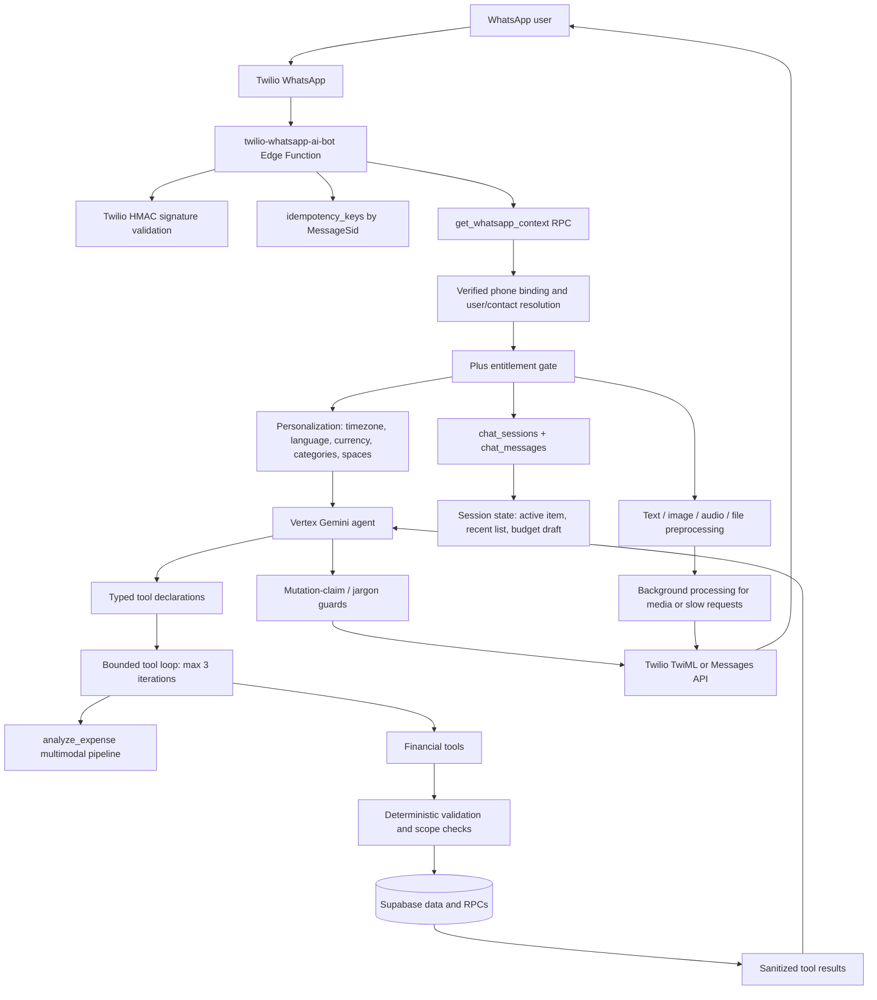

# WhatsApp AI Financial Assistant: Interview Engineering Audit

## Executive Summary

This is not a basic "WhatsApp text in, Gemini text out" integration. The verified implementation is a constrained financial agent:

```text
Twilio WhatsApp webhook
-> signature validation + MessageSid idempotency
-> phone-to-user resolution + verified binding + Plus entitlement
-> persisted chat history + scoped session state + user preferences
-> Vertex Gemini with typed financial tools
-> bounded tool-execution loop
-> deterministic validation, authorization, financial queries/writes
-> sanitized tool results back to Gemini
-> guarded final response + Twilio delivery / async fallback
```

Primary orchestration evidence: `supabase/functions/twilio-whatsapp-ai-bot/index.ts`.

## Actual Architecture



## Verified AI Capability Inventory

| Feature                                 | What it does                                                                                                                            | Why it is notable                                                                                      | Evidence                                                                                                                                                         | Classification                           | Tier |
| --------------------------------------- | --------------------------------------------------------------------------------------------------------------------------------------- | ------------------------------------------------------------------------------------------------------ | ---------------------------------------------------------------------------------------------------------------------------------------------------------------- | ---------------------------------------- | ---- |
| Tool-calling financial agent            | Lets Gemini choose financial operations rather than only generate prose.                                                                | The model plans actions, tools perform them, then results return to the model for a grounded response. | Tool registry: `twilio-whatsapp-ai-bot/index.ts:3088-3140`; loop: `:3394`; Vertex function-call support: `shared/vertex-ai-chat.ts:294-315`.                     | Agent Engineering, AI Engineering        | S    |
| Bounded multi-step execution            | Supports multiple tool turns in a request, capped at three loops.                                                                       | Prevents unbounded agent behavior while allowing workflows such as write then financial summary.       | `twilio-whatsapp-ai-bot/index.ts:3298-3307`, `:3394`, `:5100-5129`.                                                                                              | Agent Engineering, Reliability           | S    |
| Deterministic financial insight routing | Forces aggregate questions toward `financial_insight`, not row listing or LLM arithmetic.                                               | Keeps totals database-derived and prevents invented balances.                                          | `shared/bot/financial-insight-intent.ts:6-11`, `:69-130`; executor: `shared/bot/financial-insight-tool.ts:147`.                                                  | AI Engineering, Backend Engineering      | S    |
| Hallucinated-write prevention           | Blocks or repairs text that claims an action succeeded without a successful tool invocation.                                            | This is an explicit post-model guardrail, not prompt-only safety.                                      | Prompt: `shared/bot/system-instruction.ts:48-50`; repair: `twilio-whatsapp-ai-bot/index.ts:3320-3390`; final guard: `shared/bot/response-finalization.ts:40-98`. | AI Safety, Agent Engineering             | S    |
| Multimodal transaction extraction       | Processes WhatsApp receipt images, voice notes, PDFs, CSV/XLSX, and text into transaction candidates.                                   | Handles real-world financial inputs, not just chat text.                                               | WhatsApp media dispatch: `twilio-whatsapp-ai-bot/index.ts:3408-3573`; pipeline: `shared/analyze-core.ts:5259`, `:5560-6243`.                                     | Multimodal AI, Product Engineering       | A    |
| Structured transaction extraction       | Gemini returns `add_transactions` arguments for type, amount, category, currency, date, merchant, payer, and splits.                    | Uses constrained tool output instead of parsing free-form model prose.                                 | Schema: `shared/analyze-core.ts:5379-5500`; item shape: `:2152-2170`.                                                                                            | AI Engineering, Agent Engineering        | A    |
| Hybrid deterministic + AI parsing       | CSV/XLSX use deterministic parsers first; PDFs use dedicated parsing; LLM fallback is used only if required.                            | Uses deterministic code for structured input and LLMs for ambiguity.                                   | `shared/analyze-core.ts:5633-5744`, `:5799-5869`.                                                                                                                | AI Engineering, Reliability              | A    |
| Evidence-grounded extraction            | Validates extracted amounts, currency, merchant, and transaction time against source text.                                              | Reduces unsupported model extraction before persistence.                                               | `validateTransactionSourceGrounding`: `shared/analyze-core.ts:753-821`; currency evidence rules: `:6093-6096`.                                                   | AI Safety, Reliability                   | A    |
| Household split verifier                | A second independent AI decision verifies non-default household split proposals against source evidence.                                | Targeted verifier pattern for a high-impact financial decision; it fails closed.                       | `verifyHouseholdSplitProposal`: `shared/analyze-core.ts:2191-2349`; fail-closed behavior: `:6262-6271`.                                                          | AI Safety, Agent Engineering             | A    |
| Conversational reference memory         | Supports references such as "delete it," "change that," numbered transaction choices, recurring follow-ups, and budget confirmations.   | Persists task state separately from raw history.                                                       | `shared/bot/session-state.ts:8-89`, `:225-264`, `:280-420`; webhook selection: `twilio-whatsapp-ai-bot/index.ts:4120-4498`.                                      | Context Engineering, Product Engineering | A    |
| Personalized context                    | Injects language, timezone, currency, categories, category preferences/remaps, accessible spaces, and preferred space.                  | Grounds the agent in user-specific constraints.                                                        | `twilio-whatsapp-ai-bot/index.ts:2741-2765`, `:3072-3086`; `shared/bot/conversation-context.ts:14-47`.                                                           | Context Engineering, Prompt Engineering  | A    |
| Prompt architecture                     | System prompt specifies tool discipline, confirmation, scope, currency, privacy, recurrence, budgeting, charts, and channel formatting. | Encodes financial-domain operating rules.                                                              | `shared/bot/system-instruction.ts:41-109`.                                                                                                                       | Prompt Engineering                       | A    |
| Model retries and fallback              | Classifies retryable errors, applies backoff/jitter, and switches models while preserving chat history.                                 | Production resilience rather than a one-shot model call.                                               | `shared/gemini-retry.ts:74-200`; integration: `twilio-whatsapp-ai-bot/index.ts:3165-3188`.                                                                       | Reliability Engineering                  | A    |
| Async webhook delivery                  | Acknowledges quickly, maintains typing state, and moves slow/media processing into background work.                                     | Avoids webhook timeouts for 30-120 second AI/media paths.                                              | `twilio-whatsapp-ai-bot/index.ts:5397-5579`.                                                                                                                     | Production/Reliability Engineering       | A    |
| Webhook idempotency                     | Uses Twilio MessageSid in `idempotency_keys` with processing/done/failed states.                                                        | Prevents duplicate actions after webhook redelivery.                                                   | `reserveTwilioIdempotency`: `twilio-whatsapp-ai-bot/index.ts:656-700`; use: `:2344-2368`.                                                                        | Reliability Engineering                  | A    |
| Webhook authentication                  | Validates `X-Twilio-Signature` using HMAC-SHA1 and constant-time comparison.                                                            | Rejects spoofed webhooks before user/model operations.                                                 | `validateTwilioRequest`: `twilio-whatsapp-ai-bot/index.ts:723-768`; enforcement: `:2297-2325`.                                                                   | Security                                 | A    |
| User binding and OTP verification       | Maps WhatsApp phone numbers to authenticated users through expiring OTP records and atomic claims.                                      | Separates channel identity from application identity.                                                  | `initiate-whatsapp-binding/index.ts:40-99`; atomic claim: `verify-whatsapp-binding/index.ts:261-291`.                                                            | Security, Backend Engineering            | A    |
| Tool validation                         | Validates model-generated monetary values, dates, categories, currencies, IDs, strings, scope, and wallet compatibility before writes.  | The LLM is not trusted with persistence inputs.                                                        | `shared/bot/transaction-tool.ts:147-237`, `:239-339`; scope handling: `twilio-whatsapp-ai-bot/index.ts:3649-3705`.                                               | Security, Agent Engineering              | A    |
| Database-grounded analytics             | Queries transactions and recurring rows, computes totals/categories, and returns factual data for Gemini to explain.                    | LLM narrates verified facts rather than calculating totals.                                            | `shared/bot/financial-insight-tool.ts:147-352`; routing: `financial-insight-intent.ts:6-30`.                                                                     | AI Engineering, Backend Engineering      | A    |
| SSE extraction progress                 | Exposes progress stages for long-running analysis.                                                                                      | Improves extraction UX without pretending it is instant.                                               | `analyze-expense/index.ts:519-617`, `:800-812`.                                                                                                                  | Product Engineering, Reliability         | B    |

## Supported Conversational Operations

- Transactions: add one, batch import, list, update selected transaction, delete selected transaction.
- Wallets: list, create, update, and transfer between wallets.
- Spaces: create, invite members, inspect information, update settings, choose default space.
- Budgets and pockets: retrieve budget status, draft/confirm/set budgets, create/update/delete pockets and allocations.
- Recurring transactions: manage schedules, list/analyze history, and confirm/update/unconfirm/skip occurrences.
- Analytics: spending, income, cashflow, budget status, category breakdowns, financial-period summaries, and charts.
- Preferences: custom categories, preferred currency/language, preferred/default space.
- Shared finances: payer and split instructions with membership checks and split verification.

## Conversation Context and Memory

The model receives the latest 20 persisted chat messages from `chat_messages`, ordered chronologically, plus a dynamic system prompt containing date, timezone, language, currency, accessible spaces, and categories.

Separate structured state is persisted in `chat_sessions.system_prompt`:

- Last listed transactions: maximum 25, 2-hour TTL.
- Active transaction: 30-minute TTL.
- Active recurring transaction: 30-minute TTL.
- Pending budget draft: 24-hour TTL in the webhook.

Evidence: `shared/bot/conversation-context.ts:49-69` and `shared/bot/session-state.ts`.

This supports conversational references such as "delete it", "change the second one", and budget confirmation. WhatsApp sessions use `whatsapp:<phone>` and are associated with `chat_sessions.user_id`.

## Why This Is an Agentic Architecture

This is a constrained domain agent rather than a normal chatbot:

1. Gemini receives typed action declarations for transactions, wallets, budgets, recurrence, spaces, preferences, analytics, and media analysis.
2. It dynamically chooses tools from the user's request.
3. Application code executes tools with deterministic validation and authorization.
4. Sanitized tool results return to Gemini for a grounded explanation.
5. A bounded loop allows multi-step operation without unbounded agent execution.
6. Deterministic routing overrides model behavior for high-value aggregate financial questions.

The operational model is:

```text
LLM: interpret language and select/compose actions
Application: validate, authorize, calculate, and enforce rules
Tools: execute trusted reads and writes
Database: source of truth
LLM: explain verified outcomes
```

## Production Safeguards

| Area                     | Implemented safeguard                                                                                                   |
| ------------------------ | ----------------------------------------------------------------------------------------------------------------------- |
| Duplicate handling       | MessageSid idempotency reservation with processing/done/failed state.                                                   |
| Webhook security         | Twilio HMAC signature validation.                                                                                       |
| Authorization            | Verified phone binding, household membership checks, ownership checks for edits, scoped wallet lookup.                  |
| Entitlements             | WhatsApp capture requires `hasPlusEntitlement`.                                                                         |
| Tool validation          | Amount, date, category, merchant length, currency, UUID, scope, and wallet/currency validation.                         |
| Hallucination mitigation | Aggregate data comes from tools; writes cannot be claimed without a successful tool result; tool results are sanitized. |
| Model failures           | Retryable classification, backoff+jitter, model fallback, abort timeouts, user-friendly fallback response.              |
| Media failures           | MIME checks, size limits, authenticated Twilio media download, analysis timeouts, background execution.                 |
| Delivery failures        | Chunking, media delivery fallback, and idempotency delivery-state updates.                                              |
| Observability            | Phase-aware backend/tool/Vertex reporting and `analyze-expense` request timing logs.                                    |
| Sensitive output control | Tool result and user-facing response sanitization.                                                                      |

## Basic Chatbot Comparison

| Basic AI chatbot            | This implementation                                                                          |
| --------------------------- | -------------------------------------------------------------------------------------------- |
| Sends text to an LLM        | Authenticated Twilio and app request paths with user resolution.                             |
| Returns generated text      | Executes tools, grounds results, then responds.                                              |
| No tools                    | Typed financial tools for transactions, wallets, budgets, recurrence, spaces, and analytics. |
| No memory                   | 20-message history plus persisted structured short-term memory.                              |
| No real-world actions       | Validated financial reads and mutations.                                                     |
| No permissions              | Phone binding, membership/ownership checks, scoped wallet lookup, Plus gate.                 |
| No multimodal processing    | Text, receipt image, audio, PDF, CSV, XLS/XLSX, text files.                                  |
| Can invent balances/actions | Database-backed insights and mutation-claim guards.                                          |
| One-shot API call           | Bounded tool loop, retries, fallback model, timeouts, async delivery.                        |

## Practical AI Engineering Knowledge

| Knowledge                        | Evidence                                                          | Interview explanation                                                                                               |
| -------------------------------- | ----------------------------------------------------------------- | ------------------------------------------------------------------------------------------------------------------- |
| LLM application architecture     | `twilio-whatsapp-ai-bot/index.ts`.                                | "I designed orchestration around the model rather than treating the model as the system of record."                 |
| Agentic tool calling             | Typed tool declarations and execution loop.                       | "The model selects tools; application code performs trusted operations and returns results for grounded narration." |
| Prompt engineering               | `shared/bot/system-instruction.ts`.                               | "I encoded financial rules, tool discipline, ambiguity behavior, localization, privacy, and channel formatting."    |
| Context engineering              | `conversation-context.ts`, `session-state.ts`.                    | "I separated sliding history from structured operational state for references like 'delete that.'"                  |
| Structured outputs               | `shared/analyze-core.ts:5379-5500`.                               | "Extraction returns constrained arguments rather than free text."                                                   |
| Multimodal AI                    | WhatsApp media branch and `analyze-core.ts`.                      | "I built receipt, audio, and document workflows into the same financial pipeline."                                  |
| Hybrid deterministic/LLM systems | CSV/XLSX deterministic-first parsing and financial insight tools. | "I use LLMs for ambiguity, deterministic code for calculations, validation, and structured formats."                |
| Hallucination mitigation         | Mutation guards and financial insight routing.                    | "The model cannot safely claim a write without a successful tool result, and totals are data-derived."              |
| AI verification                  | Household split verifier.                                         | "For non-default shared-expense allocation, a second model verifies explicit evidence and fails closed."            |
| Production reliability           | retries, fallback, timeouts, idempotency, background execution.   | "I designed for provider retries, model overload, long media processing, and webhook redelivery."                   |

## Recruiter-Friendly Talking Points

1. I designed an agentic financial assistant where Gemini interprets natural-language requests and dynamically invokes typed financial tools, rather than acting as a free-form chatbot.
2. I separated responsibilities intentionally: the LLM understands intent and produces structured tool arguments, while deterministic services own authorization, validation, calculations, and database writes.
3. I implemented a bounded multi-turn tool loop so the assistant can retrieve data, perform an action, and generate a grounded response from actual results.
4. Aggregate spending, income, cashflow, and budget requests are routed to database-backed insight tools rather than LLM arithmetic.
5. I added a post-model mutation-claim guard that detects false success claims, retries with forced tool calling, and fails safely if the model still does not invoke the action.
6. The assistant processes text, receipt images, WhatsApp voice messages, PDFs, CSV/XLSX files, and bank-style screenshots into structured financial transactions.
7. The document pipeline uses deterministic parsing first for structured formats and LLM extraction for ambiguity and unstructured content.
8. I implemented conversation-aware follow-up behavior using persisted transaction lists, active contexts, recurring context, and budget drafts.
9. For shared expenses, I added an independent AI verifier that requires evidence from the original message before accepting non-default split allocations.
10. The WhatsApp webhook verifies Twilio signatures, deduplicates MessageSid deliveries, and uses background delivery for slow AI/media requests.
11. I implemented retryable-error classification, exponential backoff with jitter, request timeouts, and fallback Gemini models that preserve conversation history.
12. I revalidate model-generated transaction arguments for amounts, dates, currencies, categories, wallet scope, and ownership before persistence.

## 30-Second Interview Answer

I built a production-oriented WhatsApp financial assistant using Gemini on Vertex AI. Rather than using the model as a simple chatbot, I designed it as a constrained agent: it interprets natural-language requests and invokes typed tools for transactions, budgets, wallets, recurring payments, and financial analytics. The backend handles authorization, validation, calculations, and persistence, so the model never becomes the source of truth. I also built multimodal receipt, audio, and document extraction, conversation-aware follow-ups, webhook idempotency, model fallback, and safeguards to prevent the assistant from claiming a financial action succeeded unless the underlying tool actually succeeded.

## 2-Minute Technical Answer

I built an AI financial assistant that users interact with through WhatsApp. The problem was that financial chat is not just a Q&A use case. Users need to log expenses, ask for accurate totals, upload receipts, manage budgets, and make changes safely.

Twilio sends inbound WhatsApp messages to a Supabase Edge Function. I verify the Twilio signature, deduplicate using the Twilio MessageSid, resolve the phone number to a verified user, check entitlement, and load the user’s language, currency, timezone, categories, accessible shared spaces, chat history, and structured session state.

The Gemini layer is a constrained tool-calling agent. It receives typed tools for transactions, wallets, budgets, recurring payments, spaces, analytics, and media extraction. The model decides what action is needed, but it never writes directly to the database. Tool handlers validate model-generated fields, enforce user and shared-space access, resolve wallet scope and currency, invoke backend functions, and send sanitized results back to the model for the final response.

A key decision was separating deterministic financial facts from AI language generation. Aggregate requests such as spending totals or budget status route to a database-backed financial insight tool, so the model explains authoritative totals instead of calculating or inventing them.

I also built multimodal extraction for receipt photos, voice notes, PDFs, CSVs, and spreadsheets. Structured files use deterministic parsers first, with LLM fallback for ambiguous content. For shared expense splits, I added a second AI verifier that requires evidence from the original message before accepting a non-default allocation.

For reliability, the webhook supports idempotency, short acknowledgements with background processing for slow media jobs, retries with backoff, model fallback, timeouts, delivery fallbacks, and explicit guards against the model falsely claiming a transaction was saved. The main lesson was treating the LLM as a constrained reasoning layer inside a deterministic financial system, not as the system of record.

## Likely Technical Questions

| Question                                         | Suggested answer                                                                                                                                                        | Status                |
| ------------------------------------------------ | ----------------------------------------------------------------------------------------------------------------------------------------------------------------------- | --------------------- |
| Why use an LLM instead of intent classification? | The domain has multilingual, ambiguous, multimodal, and compositional requests. Tools constrain execution; deterministic routing overrides high-risk aggregate queries. | Implemented           |
| How does tool calling work?                      | Gemini receives function declarations, emits calls, the webhook executes validated handlers, returns function responses, then Gemini produces grounded text.            | Implemented           |
| How do you prevent hallucinated balances?        | Aggregate requests route to `financial_insight`, which queries and calculates from Supabase data.                                                                       | Implemented           |
| How do you prevent fake successful writes?       | Prompt prohibition, forced repair tool call, and final mutation-claim guards only allow success claims after successful execution.                                      | Implemented           |
| How do you validate tool arguments?              | Transaction tools validate amount, date, category, currency, merchant, IDs, and scope before persistence.                                                               | Implemented           |
| How do you prevent duplicate webhook writes?     | MessageSid is reserved in `idempotency_keys`; duplicate processing/done deliveries do not rerun the workflow.                                                           | Implemented           |
| How do you secure the webhook?                   | Twilio signature validation using HMAC and constant-time comparison.                                                                                                    | Implemented           |
| How is WhatsApp linked to a user?                | Authenticated OTP verification stores a verified phone-to-user association with an atomic claim.                                                                        | Implemented           |
| How do you manage context size?                  | Recent history is capped at 20; state lists are capped and TTL-bound.                                                                                                   | Implemented           |
| What happens with a wrong tool choice?           | Deterministic routing corrects aggregate and wallet cases; validation rejects bad requests; the model can ask for clarification.                                        | Partially implemented |
| How do receipt and voice workflows work?         | WhatsApp media is securely downloaded, size/type checked, then passed to structured multimodal extraction.                                                              | Implemented           |
| Why deterministic parsers as well as LLMs?       | CSV/XLSX formats are more reliable and cheaper to parse deterministically; LLMs handle semantic ambiguity.                                                              | Implemented           |
| How do you handle shared expense splits?         | Resolve membership and aliases, then run a second evidence-grounded AI verification for non-default splits.                                                             | Implemented           |
| How do you handle model outages?                 | Retry eligible failures with backoff+jitter, switch to a fallback model, enforce timeouts, and return degraded responses.                                               | Implemented           |
| How do you stop webhook timeouts?                | Acknowledge early for media/slow requests, process in background, maintain typing indicators, and deliver through Twilio API.                                           | Implemented           |
| How do you observe failures?                     | Phase-aware Vertex/tool/backend error reporting and timing logs exist.                                                                                                  | Partially implemented |
| Do you measure tokens, cost, and model quality?  | I did not find formal token/cost metrics or an evaluation harness. Those are the next maturity investments.                                                             | Not implemented       |
| How would you scale conversation safety?         | Add per-session serialization or distributed locks and durable workflow/queue execution for writes.                                                                     | Not implemented       |
| Why not use RAG/vector memory?                   | The current system needs recent operational context and authoritative financial tools more than document retrieval.                                                     | Not implemented       |

## Architecture Trade-Offs

| Decision                                         | Benefits                                                                       | Trade-off                                             | Alternative and when it is better                                                |
| ------------------------------------------------ | ------------------------------------------------------------------------------ | ----------------------------------------------------- | -------------------------------------------------------------------------------- |
| Tool-calling agent vs intent classifier          | Handles multilingual, ambiguous, compositional requests through one interface. | More variable latency/cost and tool-selection errors. | A deterministic classifier/router for narrow, high-volume intents.               |
| Recent history + explicit state vs vector memory | Predictable, bounded, direct support for references.                           | No semantic recall of old conversations.              | Semantic memory when users require long-term searchable context.                 |
| Financial insight tool vs LLM arithmetic         | Accurate, auditable database-derived totals.                                   | Requires tool/schema maintenance.                     | Do not replace this for financial facts; expand deterministic analytics instead. |
| Three-turn bounded loop                          | Caps cost/latency and prevents runaway behavior.                               | Can truncate legitimate longer workflows.             | Durable workflow orchestration for lengthy approved flows.                       |
| Background Edge Function work                    | Practical webhook timeout solution.                                            | Less durable than a queue.                            | Job queue/workflow engine at higher volume or with execution guarantees.         |
| Deterministic-first file parsing                 | Accurate and efficient for structured formats.                                 | More parser maintenance.                              | LLM-first only for low-volume, unstructured-only use cases.                      |
| Independent split verifier                       | Strong safety for shared financial allocation.                                 | Added model latency/cost and possible false rejects.  | Explicit confirmation UI for especially high-value settlement actions.           |

## Improvements to Discuss Honestly

| Current architecture                        | Improvement                                                                                                         | Why and when                                                          |
| ------------------------------------------- | ------------------------------------------------------------------------------------------------------------------- | --------------------------------------------------------------------- |
| Concurrent stateless webhook handling       | Add per-session lock or ordered message queue.                                                                      | Prevent races on session state and rapid writes.                      |
| Background promises inside an Edge Function | Use a durable queue/workflow engine with retry state.                                                               | Guarantees long media processing across process termination/failure.  |
| Logs and error reports                      | Add correlated distributed traces across Twilio, model, tools, and database.                                        | Makes latency and incident diagnosis easier at scale.                 |
| No formal quality system observed           | Build a golden dataset/evaluation harness for tool choice, extraction, hallucinated writes, and multilingual cases. | Needed before model/prompt releases at scale.                         |
| Runtime prompt strings                      | Version prompts/tool schemas and attach versions to telemetry.                                                      | Enables measurement, regression detection, and rollback.              |
| Generic model fallback                      | Add tool-level latency/success/cost metrics and adaptive routing.                                                   | Optimizes cost and model selection.                                   |
| Recent history plus state                   | Add conversation summarization and consented semantic memory.                                                       | Useful when users expect longer-term references.                      |
| Visible OTP implementation                  | Use cryptographically secure code generation and rate-limit inbound public verification requests.                   | Important as verification volume and abuse risk grow.                 |
| Bot-level scope checks                      | Audit all downstream write functions and RLS policies.                                                              | Required before claiming complete end-to-end authorization assurance. |

## Final Cheat Sheet

### Strongest AI Experience

1. Tool-calling financial agent with bounded multi-turn orchestration.
2. Deterministic financial insight tooling that grounds totals in database data.
3. Multimodal financial extraction across images, audio, PDFs, CSV, and spreadsheets.
4. Conversation-aware operational state for transaction, recurring, and budget references.
5. Production safeguards: signature verification, idempotency, retries, fallback model, async delivery, and argument validation.

### Most Impressive Architectural Feature

The LLM is intentionally not the system of record: it selects tools and explains outcomes, while deterministic services own validation, authorization, calculations, and persistence.

### Most Impressive Production Engineering Feature

Twilio MessageSid idempotency combined with fast acknowledgement/background processing and delivery-state tracking for slow AI and media workloads.

### Most Impressive Agentic Feature

Bounded tool calling with typed financial tools, sanitized tool-result feedback, forced-tool repair, and final mutation-claim blocking.

### Most Impressive Multimodal Feature

Receipt/audio/document ingestion that converts WhatsApp media into structured financial actions while using deterministic parsers first for CSV/XLSX.

### Most Important AI Safety/Reliability Feature

The assistant cannot safely claim a transaction or wallet change succeeded unless the corresponding tool succeeds; financial totals are database-grounded.

### Technologies Discovered

- TypeScript and Deno
- Supabase Edge Functions, Postgres/RPCs, Storage, and Auth
- Twilio WhatsApp and TwiML/Messages API
- Vertex AI and Gemini models
- Google Cloud Document AI
- SSE
- PDF-lib and XLSX parsing
- HMAC webhook verification

### AI Concepts to Claim Confidently

- LLM agents and function calling
- Structured output design
- Prompt/context engineering
- Multimodal extraction
- Hybrid deterministic/LLM systems
- Hallucination mitigation
- AI reliability and fallback
- Webhook idempotency
- AI authorization and tool validation
- Conversation state architecture

### Do Not Claim

- RAG or vector database memory
- Multi-agent orchestration
- Formal model evaluation framework
- Token/cost optimization platform
- Prompt versioning
- Distributed tracing
- Durable workflow queue
- Fully audited end-to-end RLS enforcement

## Audit Scope and Caveats

This is a source-level audit. The bot-level authorization, validation, idempotency, retry, prompt, and multimodal paths above were verified in the cited source files.

The downstream `save-expense`, `update-expense`, `delete-expense`, related database migrations, and RLS policies were not fully audited here. Do not claim complete end-to-end database authorization enforcement until those paths have been inspected and tested.

No source files were modified as part of the audit, and no test suite was run.
