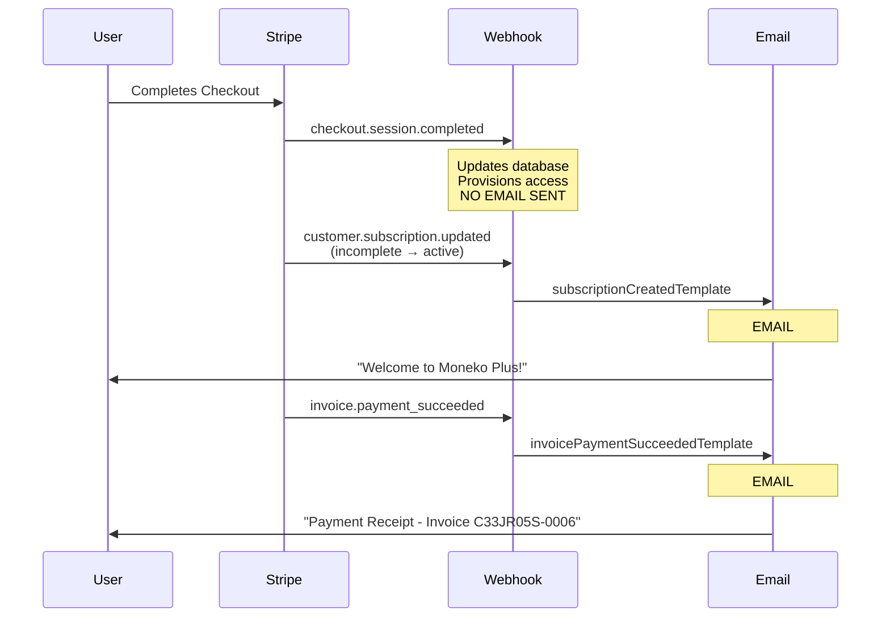
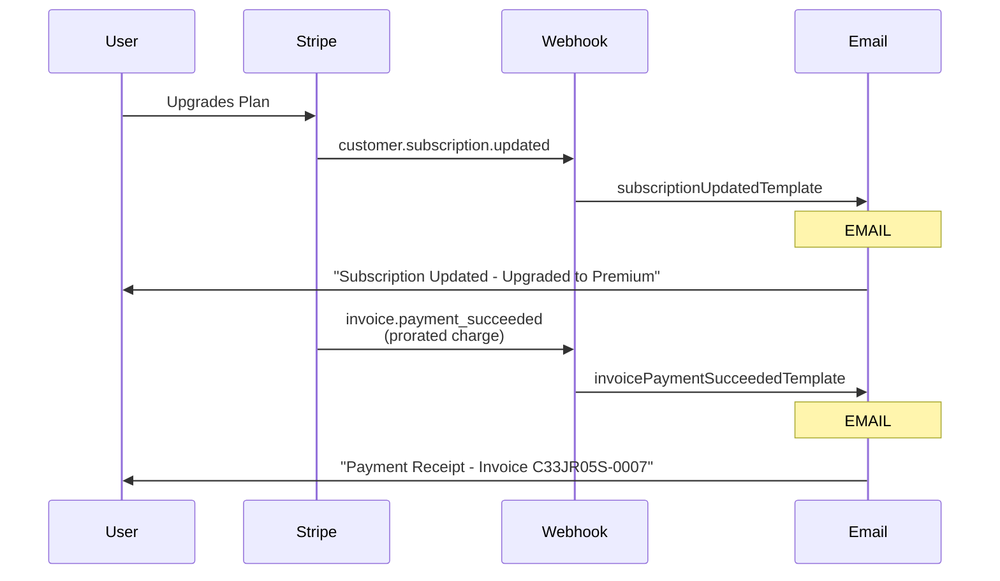
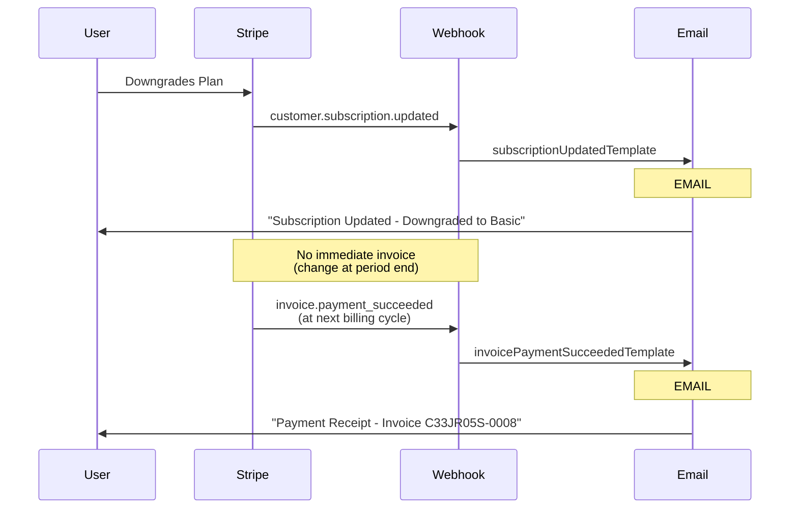
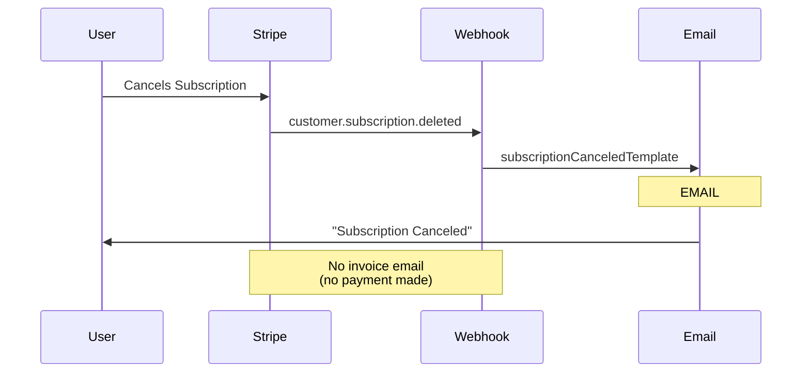
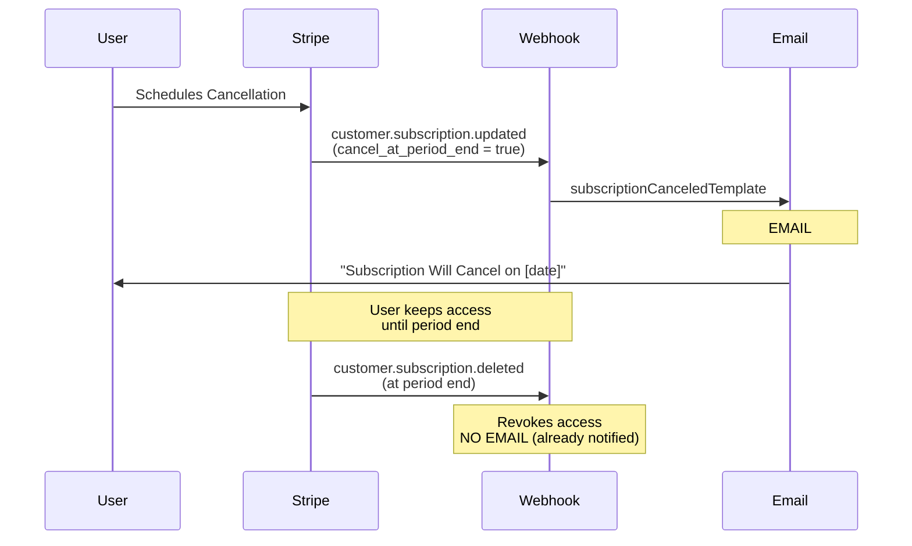
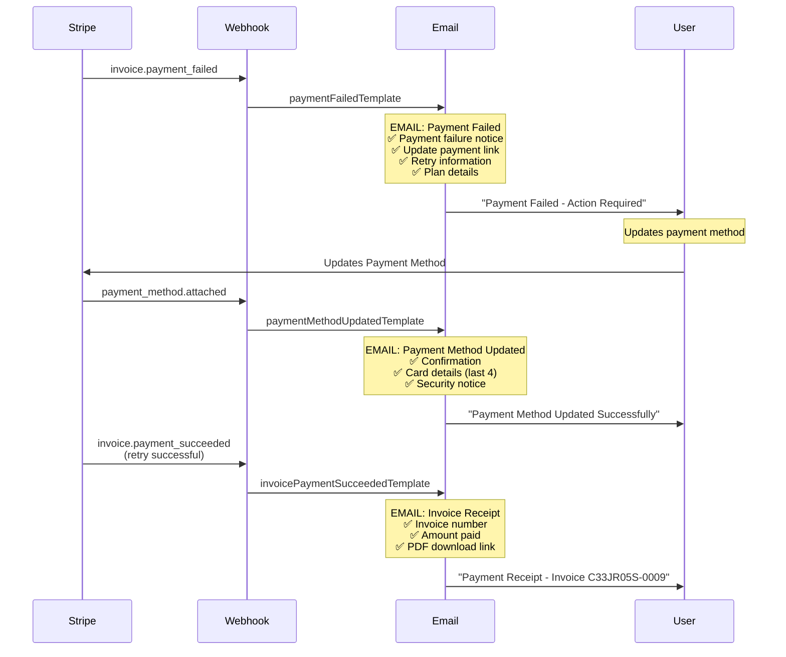
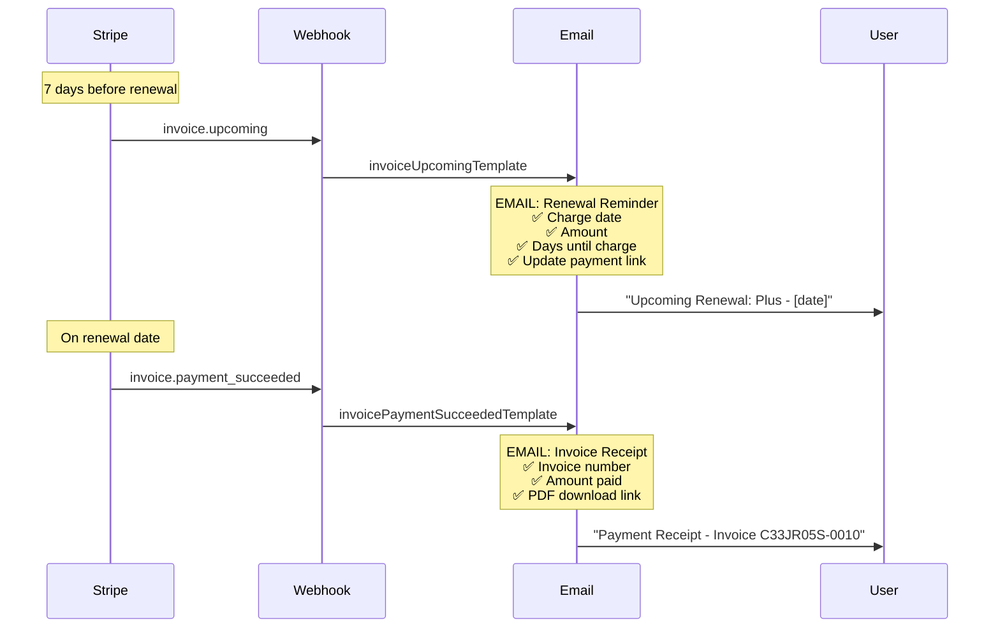
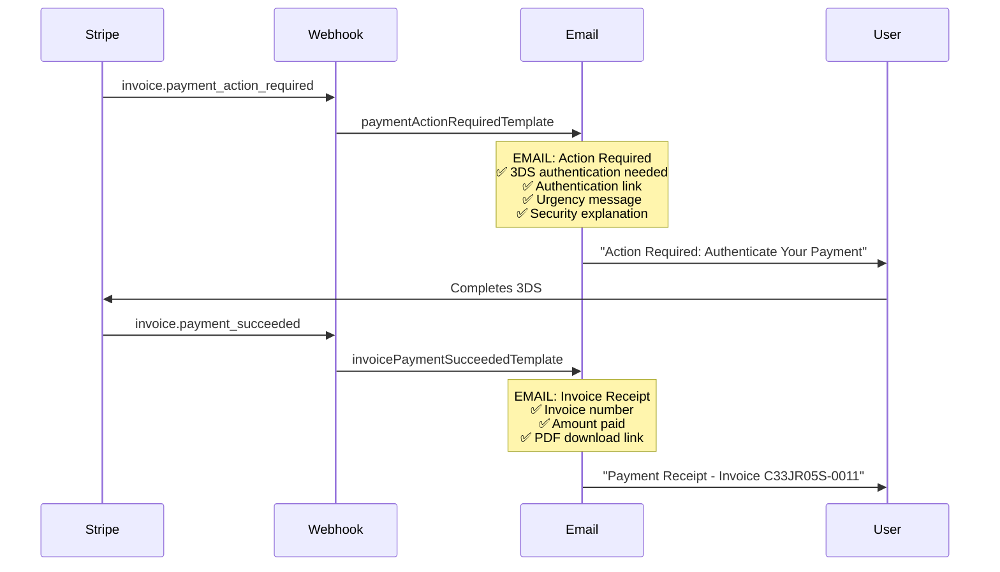

# Stripe Email Flow - Visual Diagram

## 📧 Email Separation Strategy (Stripe Best Practice)

Our implementation follows Stripe's official recommendation to **separate subscription lifecycle emails from invoice/payment emails**.

---

## 🎯 Scenario 1: New Subscription

**Result**: User receives **2 separate emails**
1. Subscription confirmation (features, access)
2. Invoice receipt (payment proof, PDF)

---

## 🔄 Scenario 2: Subscription Upgrade

**Result**: User receives **2 separate emails**
1. Upgrade confirmation (new features)
2. Invoice receipt (prorated payment)

---

## 🔄 Scenario 3: Subscription Downgrade

**Result**: User receives **2 separate emails**
1. Downgrade confirmation (immediate)
2. Invoice receipt (at next billing cycle)

---

## ❌ Scenario 4: Subscription Cancellation (Immediate)

**Result**: User receives **1 email**
1. Cancellation confirmation only

---

## ⏰ Scenario 5: Scheduled Cancellation (End of Period)

**Result**: User receives **1 email**
1. Scheduled cancellation notice (when scheduled)

---

## 💳 Scenario 6: Payment Failure

**Result**: User receives **3 emails**
1. Payment failure notification
2. Payment method update confirmation
3. Invoice receipt (after successful retry)

---

## 🔔 Scenario 7: Renewal Reminder

**Result**: User receives **2 emails**
1. Renewal reminder (7 days before)
2. Invoice receipt (on renewal)

---

## 🔐 Scenario 8: 3D Secure Authentication Required

**Result**: User receives **2 emails**
1. 3DS authentication request
2. Invoice receipt (after authentication)

---

## 📊 Email Summary Table

| Scenario | Subscription Email | Invoice Email | Total Emails |
|----------|-------------------|---------------|--------------|
| New Subscription | ✅ Welcome | ✅ Receipt + PDF | 2 |
| Upgrade | ✅ Upgrade Confirmation | ✅ Receipt + PDF | 2 |
| Downgrade | ✅ Downgrade Confirmation | ✅ Receipt + PDF (later) | 2 |
| Immediate Cancel | ✅ Cancellation | ❌ None | 1 |
| Scheduled Cancel | ✅ Scheduled Notice | ❌ None | 1 |
| Payment Failure | ❌ None | ✅ Failure Notice | 1 |
| Renewal | ❌ None | ✅ Reminder + Receipt | 2 |
| 3DS Required | ❌ None | ✅ Action + Receipt | 2 |

---

## 🎯 Key Principles

### 1. **Separation of Concerns**
- **Subscription emails** = Access, features, plan changes
- **Invoice emails** = Payment, receipts, financial records

### 2. **No Duplication**
- Subscription emails NEVER include invoice details
- Invoice emails NEVER include subscription feature details
- Each email has a single, clear purpose

### 3. **Complete Information**
- Subscription emails: What changed, when it takes effect
- Invoice emails: What was paid, invoice number, PDF link

### 4. **User Experience**
- Clear subject lines indicate email type
- Separate emails for separate concerns
- Easy to file/archive by category

---

## ✅ Implementation Verification

### Subscription Email Templates (No Invoice Data):
1. ✅ `subscriptionCreatedTemplate` - Welcome message
2. ✅ `subscriptionUpdatedTemplate` - Change confirmation
3. ✅ `subscriptionCanceledTemplate` - Cancellation notice
4. ✅ `trialEndingTemplate` - Trial expiration warning

### Invoice Email Templates (No Subscription Data):
1. ✅ `invoicePaymentSucceededTemplate` - Receipt with PDF
2. ✅ `invoiceFinalizedTemplate` - Invoice ready
3. ✅ `invoiceUpcomingTemplate` - Renewal reminder
4. ✅ `paymentFailedTemplate` - Payment failure
5. ✅ `paymentActionRequiredTemplate` - 3DS authentication

### Other Email Templates:
1. ✅ `paymentMethodUpdatedTemplate` - Payment method changes

---

## 🎉 Compliance Status

**✅ 100% COMPLIANT** with Stripe official best practices:
- Separate emails for subscription vs invoice events
- Invoice receipts include PDF download links
- Clear, purpose-specific email content
- No information duplication across email types
- Professional, user-friendly messaging

**Total Email Templates**: 10 templates covering all scenarios
**Total Webhook Events**: 15 events handled
**Email Separation**: Perfect (0 violations)
