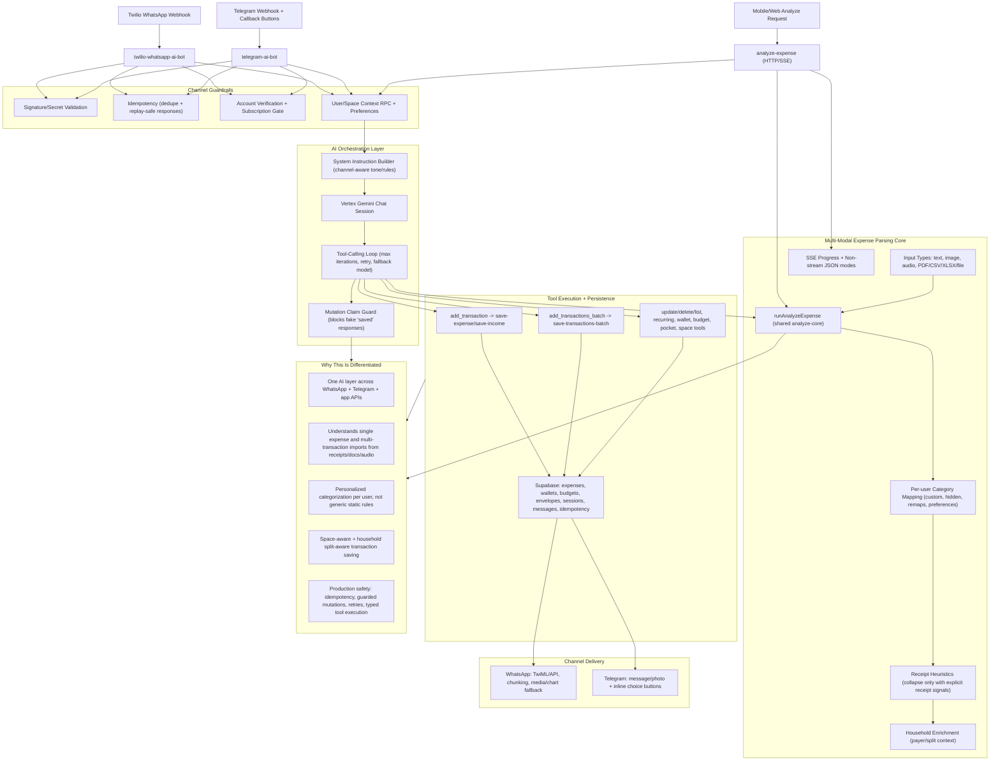

```mermaid
flowchart TB
  %% Entry channels
  WA["Twilio WhatsApp Webhook"] --> WAFN["twilio-whatsapp-ai-bot"]
  TG["Telegram Webhook + Callback Buttons"] --> TGFN["telegram-ai-bot"]
  APP["Mobile/Web Analyze Request"] --> AEFN["analyze-expense (HTTP/SSE)"]

  %% Shared guards and context
  subgraph Guard["Channel Guardrails"]
    SIG["Signature/Secret Validation"]
    IDEM["Idempotency (dedupe + replay-safe responses)"]
    VERIFY["Account Verification + Subscription Gate"]
    CTX["User/Space Context RPC + Preferences"]
  end

  WAFN --> SIG
  TGFN --> SIG
  WAFN --> IDEM
  TGFN --> IDEM
  WAFN --> VERIFY
  TGFN --> VERIFY
  WAFN --> CTX
  TGFN --> CTX
  AEFN --> CTX

  %% AI orchestration
  subgraph AI["AI Orchestration Layer"]
    PROMPT["System Instruction Builder (channel-aware tone/rules)"]
    GEMINI["Vertex Gemini Chat Session"]
    LOOP["Tool-Calling Loop (max iterations, retry, fallback model)"]
    SAFE["Mutation Claim Guard (blocks fake 'saved' responses)"]
  end

  CTX --> PROMPT --> GEMINI --> LOOP --> SAFE

  %% Parsing core
  subgraph PARSE["Multi-Modal Expense Parsing Core"]
    CORE["runAnalyzeExpense (shared analyze-core)"]
    INPUTS["Input Types: text, image, audio, PDF/CSV/XLSX/file"]
    CAT["Per-user Category Mapping (custom, hidden, remaps, preferences)"]
    RECEIPT["Receipt Heuristics (collapse only with explicit receipt signals)"]
    SPLIT["Household Enrichment (payer/split context)"]
    STREAM["SSE Progress + Non-stream JSON modes"]
  end

  LOOP --> CORE
  AEFN --> CORE
  INPUTS --> CORE
  CORE --> CAT --> RECEIPT --> SPLIT
  AEFN --> STREAM

  %% Tool execution / persistence
  subgraph EXEC["Tool Execution + Persistence"]
    ADD1["add_transaction -> save-expense/save-income"]
    ADDB["add_transactions_batch -> save-transactions-batch"]
    MUT["update/delete/list, recurring, wallet, budget, pocket, space tools"]
    DB["Supabase: expenses, wallets, budgets, envelopes, sessions, messages, idempotency"]
  end

  LOOP --> ADD1 --> DB
  LOOP --> ADDB --> DB
  LOOP --> MUT --> DB

  %% Response delivery
  subgraph OUT["Channel Delivery"]
    WAOUT["WhatsApp: TwiML/API, chunking, media/chart fallback"]
    TGOUT["Telegram: message/photo + inline choice buttons"]
  end

  DB --> WAOUT
  DB --> TGOUT

  %% Differentiators
  subgraph USP["Why This Is Differentiated"]
    U1["One AI layer across WhatsApp + Telegram + app APIs"]
    U2["Understands single expense and multi-transaction imports from receipts/docs/audio"]
    U3["Personalized categorization per user, not generic static rules"]
    U4["Space-aware + household split-aware transaction saving"]
    U5["Production safety: idempotency, guarded mutations, retries, typed tool execution"]
  end

  SAFE --> USP
  CORE --> USP
  EXEC --> USP
```
