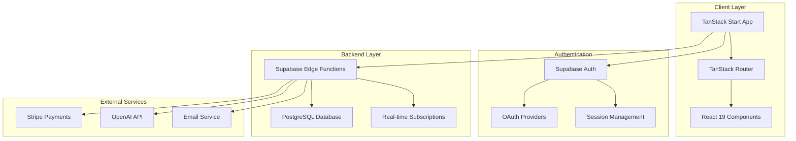

# Moneko Architecture Documentation

**Comprehensive technical architecture for TanStack Start + Supabase platform**

## System Overview

Moneko is a personal finance education and budgeting platform built with a modern, scalable architecture that separates frontend and backend concerns while leveraging cloud-native services.



## Technology Stack

### Frontend Architecture

**Framework**: TanStack Start (React-based full-stack framework)
- **Version**: Latest stable
- **Rendering**: Client-side rendering (SPA)
- **Build Tool**: Vite
- **TypeScript**: Strict mode enabled

**Routing**: TanStack Router
- **Type**: File-based routing
- **Location**: `/src/routes/`
- **Features**: Type-safe routes, search parameter validation, nested layouts

**State Management**:
- **Global State**: Redux Toolkit
- **Server State**: React Query (TanStack Query)
- **Authentication**: React Context
- **Component State**: React hooks (useState, useReducer)

**Styling**: Tailwind CSS
- **Configuration**: Custom color scheme and typography
- **Components**: Shadcn/ui component library
- **Icons**: FontAwesome
- **Responsive**: Mobile-first approach

### Backend Architecture

**Primary Backend**: Supabase (Backend-as-a-Service)
- **Database**: PostgreSQL with real-time capabilities
- **Authentication**: Supabase Auth with OAuth support
- **Storage**: Supabase Storage for file management
- **Functions**: Edge Functions (Deno runtime)

**Edge Functions Location**: `/supabase/functions/`
```
supabase/functions/
├── ai-goal-generator/           # AI-powered goal generation
├── ai-onboarding-coach/         # Onboarding assistance
├── chat_messages/               # Chat message handling
├── chat_sessions/               # Chat session management  
├── chat_stream/                 # Real-time chat streaming
├── financial-health-profile/    # Health profile analysis
├── goal-tracker-ai/             # Goal tracking with AI
├── stripe-webhook/              # Payment processing
├── send-email/                  # Email notifications
├── user-activities/             # User activity tracking
└── shared/                      # Common utilities
    ├── cors.ts                  # CORS configuration
    ├── email-service.ts         # Email utilities
    └── template-loader.ts       # Template management
```

**Database Schema Management**: 
- **Location**: `/supabase/migrations/`
- **Version Control**: SQL migration files with timestamps
- **Key Migrations**:
  - `create_tables.sql` - Core user and content tables
  - `create_chat_tables.sql` - Chat functionality
  - `create_avatar_storage.sql` - Avatar customization
  - `20250827_update_oauth_user_trigger.sql` - OAuth user handling

## Core Features Architecture

### 1. Authentication System

**Implementation**: Supabase Auth with built-in OAuth
- **OAuth Providers**: Google (configured), extensible for others
- **Email Auth**: Sign up, sign in, password reset
- **Session Management**: Automatic session persistence
- **User Profiles**: Extended user data in custom tables

**File Structure**:
```
src/
├── components/auth/
│   ├── google-login-button.tsx     # OAuth login
│   ├── shadcn-sign-in-form.tsx     # Email login
│   └── shadcn-sign-up-form.tsx     # Email registration
├── contexts/
│   └── auth-context.tsx            # Authentication context
├── routes/auth/
│   ├── callback/index.tsx          # OAuth callback handler
│   └── confirm/index.tsx           # Email confirmation handler
└── lib/
    └── supabase.ts                 # Supabase client config
```

### 2. Financial Calculators

**Client-Side Implementation**: React components with TypeScript
- **Compound Interest Calculator**
- **Mortgage Calculator** 
- **Retirement Calculator**
- **Auto Loan Calculator**
- **Investment Calculator**
- **Savings Goals Calculator**

**Features**:
- Real-time calculations
- Interactive charts and visualizations
- Export/sharing capabilities
- Mobile-responsive design

### 3. Learning Platform

**Content Management**: Database-driven course system
- **Courses**: Structured learning paths
- **Lessons**: Individual learning units
- **Progress Tracking**: User completion status
- **XP System**: Gamification elements

**Backend Functions**:
- `get-user-courses/` - Retrieve user's enrolled courses
- `get-user-completed-lessons/` - Track lesson completion
- `get-user-xp/` - Experience point management
- `unlock-next-lesson/` - Progressive lesson unlocking

### 4. AI Chat Interface

**Implementation**: Real-time chat with OpenAI integration
- **Streaming Responses**: Real-time AI response streaming
- **Session Management**: Persistent chat sessions
- **Context Awareness**: Financial education context
- **Message History**: Complete conversation tracking

**Backend Functions**:
- `chat_stream/` - Handle streaming AI responses
- `chat_sessions/` - Manage chat sessions  
- `chat_messages/` - Store and retrieve messages
- `ai-onboarding-coach/` - Specialized coaching AI

### 5. Dashboard System

**Customizable Widgets**: Drag-and-drop dashboard interface
- **Dashboard Templates**: Pre-configured layouts
- **Custom Views**: User-personalized dashboards
- **Real-time Data**: Live financial data updates
- **Export Capabilities**: Data export and reporting

**Backend Functions**:
- `dashboard-templates/` - Template management
- `dashboard-views/` - User dashboard configurations
- `dashboard/` - Dashboard data aggregation

### 6. Goal Tracking System

**AI-Enhanced Goal Management**: Comprehensive goal tracking
- **Goal Creation**: AI-assisted goal generation
- **Progress Tracking**: Milestone and progress monitoring
- **Timeline Management**: Goal timeline optimization
- **Insights Generation**: AI-powered insights and recommendations

**Backend Functions**:
- `ai-goal-generator/` - AI-powered goal creation
- `goal-tracker-ai/` - AI goal management
- `goal-progress-tracker/` - Progress monitoring
- `goal-milestone-manager/` - Milestone management
- `goal-timeline-manager/` - Timeline optimization
- `goal-insights-generator/` - AI insights generation

## Data Architecture

### Database Design Philosophy

**Principles**:
- **Normalization**: Proper relational design
- **Performance**: Optimized queries and indexing
- **Security**: Row Level Security (RLS) policies
- **Scalability**: Designed for growth
- **Flexibility**: Extensible schema design

### Key Database Tables

**User Management**:
```sql
-- Core user profiles
users (
  id UUID PRIMARY KEY,
  email TEXT UNIQUE NOT NULL,
  full_name TEXT,
  avatar_url TEXT,
  last_login TIMESTAMP,
  created_at TIMESTAMP
)

-- Avatar customization
user_avatars (
  id UUID PRIMARY KEY,
  user_id UUID REFERENCES users(id),
  avatar_data JSONB,
  created_at TIMESTAMP
)
```

**Content Management**:
```sql
-- Learning courses
courses (
  id UUID PRIMARY KEY,
  title TEXT NOT NULL,
  description TEXT,
  difficulty_level INTEGER,
  created_at TIMESTAMP
)

-- Individual lessons
lessons (
  id UUID PRIMARY KEY,
  course_id UUID REFERENCES courses(id),
  title TEXT NOT NULL,
  content JSONB,
  order_index INTEGER
)
```

**Chat System**:
```sql
-- Chat sessions
chat_sessions (
  id UUID PRIMARY KEY,
  user_id UUID REFERENCES users(id),
  title TEXT,
  created_at TIMESTAMP
)

-- Chat messages
chat_messages (
  id UUID PRIMARY KEY,
  session_id UUID REFERENCES chat_sessions(id),
  role TEXT CHECK (role IN ('user', 'assistant')),
  content TEXT,
  created_at TIMESTAMP
)
```

**Goal Tracking**:
```sql
-- User goals
goals (
  id UUID PRIMARY KEY,
  user_id UUID REFERENCES users(id),
  title TEXT NOT NULL,
  description TEXT,
  target_amount DECIMAL,
  target_date DATE,
  status TEXT,
  created_at TIMESTAMP
)

-- Goal milestones
goal_milestones (
  id UUID PRIMARY KEY,
  goal_id UUID REFERENCES goals(id),
  title TEXT NOT NULL,
  target_date DATE,
  completed BOOLEAN DEFAULT FALSE
)
```

### Row Level Security (RLS)

**Security Policies**: Comprehensive data protection
```sql
-- Users can only access their own data
ALTER TABLE users ENABLE ROW LEVEL SECURITY;
CREATE POLICY users_self_access ON users
  FOR ALL USING (auth.uid() = id);

-- Chat sessions restricted to owners
ALTER TABLE chat_sessions ENABLE ROW LEVEL SECURITY;  
CREATE POLICY chat_sessions_owner ON chat_sessions
  FOR ALL USING (auth.uid() = user_id);

-- Goal data privacy
ALTER TABLE goals ENABLE ROW LEVEL SECURITY;
CREATE POLICY goals_owner ON goals
  FOR ALL USING (auth.uid() = user_id);
```

## API Architecture

### Edge Functions Design

**Runtime**: Deno (V8 JavaScript runtime)
- **Performance**: Fast cold start times
- **TypeScript**: Native TypeScript support
- **Security**: Secure by default with permissions model
- **Scalability**: Automatic scaling with edge deployment

**Function Structure**:
```typescript
// Standard Edge Function pattern
import { corsHeaders } from "corsHeaders"

Deno.serve(async (req: Request) => {
  // Handle CORS preflight
  if (req.method === 'OPTIONS') {
    return new Response(null, { status: 200, headers: corsHeaders })
  }

  try {
    // Function logic here
    const result = await processRequest(req)
    
    return new Response(JSON.stringify(result), {
      headers: { ...corsHeaders, 'Content-Type': 'application/json' }
    })
  } catch (error) {
    return new Response(JSON.stringify({ error: error.message }), {
      status: 400,
      headers: { ...corsHeaders, 'Content-Type': 'application/json' }
    })
  }
})
```

### API Categories

**Authentication Functions**:
- Built-in Supabase Auth handles OAuth and email authentication
- Custom triggers for user profile creation
- Session management and validation

**AI Functions**:
- `ai-goal-generator/` - Generate personalized financial goals
- `ai-onboarding-coach/` - Interactive onboarding assistance
- `chat_stream/` - Real-time AI chat responses
- `financial-health-profile/` - AI health assessments
- `predict-user-responses/` - Predictive user modeling

**Business Functions**:
- `create-checkout-session/` - Stripe payment initialization
- `stripe-webhook/` - Payment webhook handling
- `manage-payment-method/` - Payment method management
- `verify-payment/` - Payment verification

**Communication Functions**:
- `send-email/` - Email notifications and transactional emails
- `newsletter-subscription/` - Newsletter management
- `user-activities/` - Activity tracking and logging

**Content Functions**:
- `store-course-from-ai/` - AI-generated course storage
- `get-user-courses/` - User course enrollment
- `unlock-next-lesson/` - Progressive lesson unlocking
- `sitemap-generator/` - SEO sitemap generation

## Security Architecture

### Authentication Security

**OAuth Security**:
- PKCE (Proof Key for Code Exchange) flow
- Secure redirect URL validation
- Session token encryption
- Cross-site request forgery (CSRF) protection

**Session Management**:
- HTTP-only cookies for session storage
- Automatic session refresh
- Secure session invalidation
- Multi-device session management

### Database Security

**Access Control**:
- Row Level Security (RLS) on all user tables
- Service role separation
- Principle of least privilege
- Audit logging for sensitive operations

**Data Protection**:
- Encryption at rest and in transit
- Personal data anonymization options
- GDPR compliance capabilities
- Data retention policies

### API Security

**Edge Function Security**:
- Input validation and sanitization
- Rate limiting and throttling
- CORS policy enforcement
- Environment variable security

**External API Security**:
- API key rotation and management
- Webhook signature verification
- SSL/TLS certificate validation
- Network security policies

## Performance Architecture

### Frontend Optimization

**Bundle Optimization**:
- Code splitting by route
- Lazy loading of components
- Tree shaking of unused code
- Asset optimization and compression

**Runtime Performance**:
- React 19 concurrent features
- Optimistic updates for better UX
- Efficient state management
- Memoization of expensive calculations

### Backend Optimization

**Database Performance**:
- Strategic indexing on frequently queried columns
- Connection pooling and management
- Query optimization and analysis
- Real-time subscription efficiency

**Edge Function Performance**:
- Cold start optimization
- Efficient memory usage
- Parallel processing where applicable
- Caching strategies for repeated operations

### Caching Strategy

**Multi-Level Caching**:
- Browser caching for static assets
- Application-level caching for computed data
- Database query result caching
- CDN caching for global content delivery

## Deployment Architecture

### Development Environment

**Local Development**:
```bash
# Frontend development server
npm run dev              # Port 3000

# Supabase local development
supabase start          # Local Supabase instance
supabase functions serve # Local Edge Functions

# Database management
supabase db reset       # Reset local database
supabase db push        # Apply migrations
```

**Development Stack**:
- Local Supabase instance with Docker
- Hot module replacement for frontend
- Live reloading for Edge Functions
- Local database with test data

### Production Environment

**Hosting**:
- **Frontend**: Vercel/Netlify (static hosting)
- **Backend**: Supabase Cloud (managed service)
- **Database**: Supabase PostgreSQL (managed)
- **Functions**: Supabase Edge Functions (global deployment)

**CI/CD Pipeline**:
```yaml
# GitHub Actions workflow
name: Deploy
on:
  push:
    branches: [main]

jobs:
  deploy:
    runs-on: ubuntu-latest
    steps:
      - uses: actions/checkout@v3
      - name: Deploy to Supabase
        run: |
          supabase functions deploy
          supabase db push
      - name: Deploy Frontend
        run: |
          npm ci
          npm run build
          # Deploy to hosting provider
```

### Monitoring and Observability

**Application Monitoring**:
- Real-time error tracking
- Performance monitoring
- User behavior analytics
- API endpoint monitoring

**Infrastructure Monitoring**:
- Database performance metrics
- Edge Function execution metrics
- Authentication success rates
- Payment processing monitoring

## Scalability Considerations

### Horizontal Scaling

**Frontend Scaling**:
- CDN distribution for global performance
- Static asset optimization
- Progressive Web App (PWA) capabilities
- Offline functionality for core features

**Backend Scaling**:
- Supabase automatic scaling
- Edge Function geographic distribution
- Database connection pooling
- Read replica support

### Data Scaling

**Database Scaling**:
- Partitioning strategies for large tables
- Archival policies for historical data
- Efficient indexing strategies
- Query optimization for scale

**Storage Scaling**:
- File storage optimization
- Image compression and optimization
- Asset versioning and management
- Backup and recovery strategies

## Future Architecture Considerations

### Planned Enhancements

**Microservices Evolution**:
- Service decomposition strategies
- Event-driven architecture
- Message queue integration
- Service mesh considerations

**Advanced Features**:
- Real-time collaboration features
- Advanced analytics and reporting
- Machine learning model integration
- International localization support

### Technology Roadmap

**Framework Updates**:
- React Server Components adoption
- Advanced Suspense patterns
- Streaming SSR capabilities
- Performance optimization techniques

**Backend Evolution**:
- Advanced AI integrations
- Enhanced real-time capabilities
- Improved analytics and insights
- Extended third-party integrations

## Conclusion

The Moneko architecture provides:

✅ **Scalable Foundation**: Built for growth with modern, cloud-native technologies  
✅ **Developer Experience**: Excellent DX with TypeScript, modern tooling, and clear patterns  
✅ **Security First**: Comprehensive security measures at all architectural layers  
✅ **Performance Optimized**: Multi-level optimization strategies for speed and efficiency  
✅ **Maintainable Code**: Clear separation of concerns and well-documented patterns  
✅ **Production Ready**: Robust deployment and monitoring infrastructure

This architecture serves as a solid foundation for the Moneko financial education platform while providing flexibility for future growth and feature expansion.