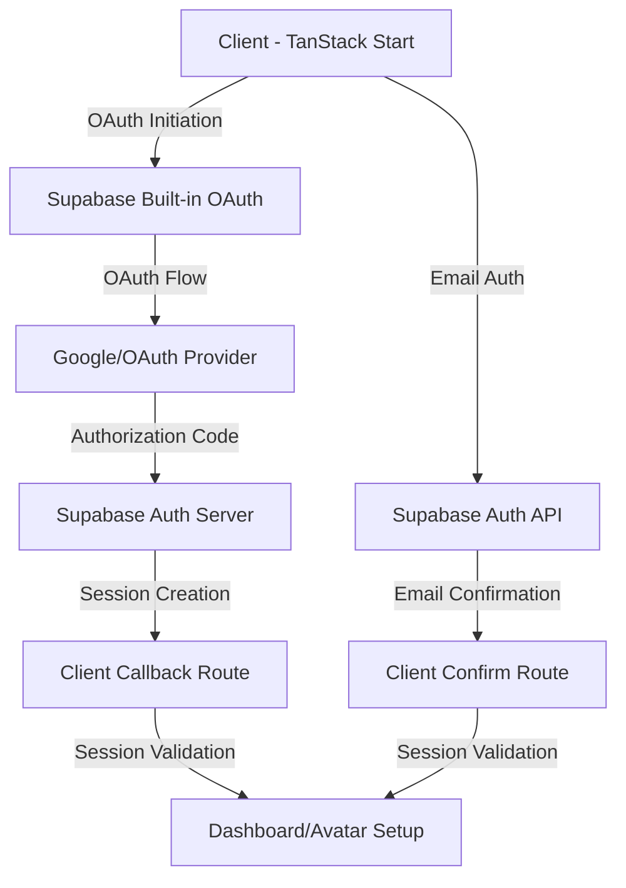

# Authentication Documentation - Moneko

**Complete guide for the TanStack Start + Supabase authentication system**

## Architecture Overview

**Frontend**: TanStack Start + TanStack Router (client-side only)  
**Backend**: Supabase Edge Functions + PostgreSQL  
**Authentication**: Supabase Auth with built-in OAuth support



## Directory Structure

```
moneko-web/
├── src/
│   ├── components/auth/
│   │   ├── google-login-button.tsx      # OAuth login component
│   │   ├── shadcn-sign-in-form.tsx      # Email login form
│   │   └── shadcn-sign-up-form.tsx      # Email signup form
│   ├── routes/auth/
│   │   ├── callback/index.tsx           # OAuth callback handler
│   │   └── confirm/index.tsx            # Email confirmation handler
│   ├── contexts/
│   │   └── auth-context.tsx             # Authentication context
│   └── lib/
│       └── supabase.ts                  # Supabase client configuration
├── supabase/
│   ├── functions/                       # Edge Functions (Backend)
│   │   ├── [40+ business functions]
│   │   └── shared/cors.ts               # CORS configuration
│   └── migrations/                      # Database migrations
│       ├── 20250827_update_oauth_user_trigger.sql
│       └── [15+ migration files]
```

## Authentication Flows

### 1. Google OAuth Flow

**Implementation**: Uses Supabase's built-in OAuth callback system

```typescript
// src/components/auth/google-login-button.tsx
await supabase.auth.signInWithOAuth({
  provider: 'google',
  options: {
    redirectTo: `${window.location.origin}/auth/callback?next=${next}`,
    // Essential OAuth scopes for Google authentication:
    // - 'userinfo.email': Required to retrieve the user's email address
    // - 'userinfo.profile': Provides access to basic profile info (name, avatar)  
    // - 'openid': Standard OpenID Connect scope for authentication
    scopes: 'https://www.googleapis.com/auth/userinfo.email https://www.googleapis.com/auth/userinfo.profile openid',
    // Query parameters for enhanced compatibility:
    // - 'access_type: offline': Enables refresh token for long-term access
    // - 'prompt: consent': Forces consent screen for Google Workspace users
    queryParams: {
      access_type: 'offline',
      prompt: 'consent',
    }
  }
})
```

**Flow Sequence**:
1. Client initiates OAuth via `signInWithOAuth`
2. User redirected to Google consent screen
3. Google redirects to Supabase built-in callback: `https://[project].supabase.co/auth/v1/callback`
4. Supabase processes OAuth code exchange automatically
5. User redirected to client callback: `/auth/callback?next=/dashboard`
6. Client validates session and redirects to appropriate page

### 2. Email Authentication Flow

**Sign Up with Email Confirmation**:
```typescript
// src/contexts/auth-context.tsx
await supabase.auth.signUp({
  email,
  password,
  options: {
    emailRedirectTo: `${window.location.origin}/auth/confirm?next=${next}`,
    data: userData
  },
})
```

**Flow Sequence**:
1. User submits sign-up form
2. Confirmation email sent with link to `/auth/confirm`
3. User clicks email link
4. Client validates session and redirects to dashboard

### 3. Password Sign-In Flow

```typescript
await supabase.auth.signInWithPassword({
  email,
  password,
})
```

**Direct authentication** - no additional callback handling required.

## Core Components

### GoogleLoginButton Component

**Location**: `src/components/auth/google-login-button.tsx`

**Key Features**:
- Loading state management
- Error handling with user-friendly messages
- Comprehensive OAuth scopes and parameters
- Production-ready (no debug logging)

**Props**:
```typescript
interface GoogleLoginButtonProps {
  redirectUrl?: string    // Post-auth redirect destination
  className?: string      // Styling classes
  disabled?: boolean      // Disable button state
}
```

### Authentication Context

**Location**: `src/contexts/auth-context.tsx`

**Provides**:
```typescript
type AuthContextType = {
  user: User | null
  session: Session | null
  isLoading: boolean
  isAuthenticated: boolean
  signUp: (email, password, userData, redirectUrl?) => Promise<{success: boolean; data: any}>
  signIn: (email, password) => Promise<{success: boolean; data: any}>
  signOut: () => Promise<{success: boolean}>
  resetPassword: (email, redirectUrl?) => Promise<{success: boolean; data?: any}>
  deleteAccount: () => Promise<{success: boolean}>
}
```

**Features**:
- Extended user type with `uid` alias for compatibility
- Automatic last login tracking
- Session persistence across page reloads
- Real-time auth state changes

### Callback Route Handler

**Location**: `src/routes/auth/callback/index.tsx`

**Responsibilities**:
- OAuth callback processing
- Session validation
- Avatar setup flow integration
- Error handling with user feedback
- Automatic redirection to intended destination

**Key Implementation**:
```typescript
// Session validation with fallback timing
const { data: { session }, error } = await supabase.auth.getSession()

if (session) {
  // Immediate session available
  const needsAvatar = await shouldPromptForAvatar()
  navigate({ to: needsAvatar ? '/avatar-customizer' : next })
} else {
  // Wait for Supabase to process OAuth callback
  setTimeout(async () => {
    const { data: { session } } = await supabase.auth.getSession()
    // Handle session or redirect to login with error
  }, 1000)
}
```

## Configuration

### Supabase Dashboard Settings

**Authentication → URL Configuration**:
```
# Site URL
http://localhost:3000

# Additional Redirect URLs  
http://localhost:3000/auth/callback
http://localhost:3000/auth/confirm
http://localhost:3000/**
```

### Google Cloud Console Settings

**APIs & Services → Credentials → OAuth 2.0 Client**:

**Authorized JavaScript origins**:
```
http://localhost:3000
https://your-domain.com
```

**Authorized redirect URIs**:
```
https://[your-project-id].supabase.co/auth/v1/callback
```

**Note**: Use Supabase's built-in callback URL, not custom endpoints.

### Environment Variables

```env
# Frontend (.env.local)
VITE_SUPABASE_URL=https://[project-id].supabase.co
VITE_SUPABASE_ANON_KEY=your-anon-key

# Backend (supabase/functions/.env)
SUPABASE_URL=https://[project-id].supabase.co  
SUPABASE_SERVICE_ROLE_KEY=your-service-role-key
```

## Database Schema

### Key Authentication Tables

**Users Table** (Enhanced profile):
```sql
-- Located in supabase/migrations/create_tables.sql
CREATE TABLE users (
  id UUID REFERENCES auth.users(id) PRIMARY KEY,
  email TEXT UNIQUE NOT NULL,
  full_name TEXT,
  avatar_url TEXT,
  last_login TIMESTAMP WITH TIME ZONE,
  created_at TIMESTAMP WITH TIME ZONE DEFAULT NOW()
);
```

**Avatar Customization**:
```sql
-- Located in supabase/migrations/20240101000000_add_avatar_customization.sql
CREATE TABLE user_avatars (
  id UUID DEFAULT gen_random_uuid() PRIMARY KEY,
  user_id UUID REFERENCES auth.users(id) ON DELETE CASCADE,
  avatar_data JSONB NOT NULL,
  created_at TIMESTAMP WITH TIME ZONE DEFAULT NOW()
);
```

### Triggers and Functions

**OAuth User Creation Trigger**:
```sql
-- Located in supabase/migrations/20250827_update_oauth_user_trigger.sql
CREATE OR REPLACE FUNCTION handle_auth_user_creation()
RETURNS TRIGGER AS $$
BEGIN
  INSERT INTO users (id, email, full_name, avatar_url)
  VALUES (
    NEW.id,
    NEW.email,
    COALESCE(NEW.raw_user_meta_data->>'full_name', NEW.raw_user_meta_data->>'name'),
    NEW.raw_user_meta_data->>'avatar_url'
  );
  RETURN NEW;
END;
$$ LANGUAGE plpgsql SECURITY DEFINER;

CREATE TRIGGER on_auth_user_created
  AFTER INSERT ON auth.users
  FOR EACH ROW
  EXECUTE FUNCTION handle_auth_user_creation();
```

## Error Handling

### Common Issues and Solutions

**1. "Unable to exchange external code" Error**

**Root Cause**: Incorrect redirect URL configuration

**Solution**: 
- Use Supabase's built-in callback URL in OAuth provider settings
- Ensure redirect URLs match exactly in both Supabase and OAuth provider

**2. Session Not Found After OAuth**

**Root Cause**: Timing issue with session creation

**Solution**: 
- Implemented fallback timing in callback handler
- Session validation with retry mechanism

**3. Google Workspace Authentication Issues**

**Root Cause**: Missing consent prompt for workspace users

**Solution**:
- Added `prompt: 'consent'` parameter
- Included comprehensive OAuth scopes

### Error States

**Component-Level Error Handling**:
```typescript
// GoogleLoginButton - User-friendly error display
if (error) {
  setError(error.message || 'Failed to sign in with Google')
}

// Callback Route - Redirect to login with error context
navigate({ 
  to: '/login', 
  search: { 
    redirect: next,
    error: 'Authentication failed. Please try again.'
  }
})
```

## Security Considerations

### OAuth Security

1. **PKCE Flow**: Supabase automatically handles PKCE for OAuth flows
2. **Scope Limitation**: Only request necessary OAuth scopes
3. **Redirect URL Validation**: Supabase validates redirect URLs against allow list
4. **Session Security**: Sessions managed server-side by Supabase

### Row Level Security (RLS)

```sql
-- Enable RLS on user tables
ALTER TABLE users ENABLE ROW LEVEL SECURITY;

-- Users can only access their own data
CREATE POLICY users_self_access ON users
  FOR ALL USING (auth.uid() = id);
```

## Deployment

### Edge Functions Deployment

```bash
# Deploy all Edge Functions
supabase functions deploy

# Deploy specific function
supabase functions deploy [function-name]
```

### Database Migrations

```bash
# Apply pending migrations
supabase db push

# Reset database (development only)
supabase db reset
```

### Production Configuration

**Supabase Production Settings**:
1. Update redirect URLs to production domains
2. Configure custom SMTP for email delivery
3. Set up proper CORS policies
4. Review and apply database policies

**Google Cloud Console Production**:
1. Add production domains to authorized origins
2. Update redirect URIs to production Supabase URL
3. Verify OAuth consent screen settings

## Testing

### Local Testing Setup

1. **Start Supabase locally**:
   ```bash
   supabase start
   ```

2. **Configure local environment**:
   ```env
   VITE_SUPABASE_URL=http://localhost:54321
   VITE_SUPABASE_ANON_KEY=your-local-anon-key
   ```

3. **Test OAuth flow**:
   - Ensure Google OAuth redirect points to local Supabase
   - Test both successful and error scenarios

### Test Cases

**OAuth Flow Testing**:
- [ ] Successful Google OAuth authentication  
- [ ] OAuth cancellation by user
- [ ] Invalid redirect URL handling
- [ ] Session persistence across page reloads
- [ ] Avatar setup flow after OAuth

**Email Authentication Testing**:
- [ ] Sign up with email confirmation
- [ ] Password sign-in
- [ ] Password reset flow
- [ ] Email confirmation link expiration

## Maintenance

### Regular Updates

1. **Dependency Updates**: Keep Supabase client libraries updated
2. **Security Reviews**: Regular review of OAuth configurations
3. **Migration Management**: Plan and test database schema changes
4. **Performance Monitoring**: Monitor authentication success rates

### Monitoring

**Key Metrics to Track**:
- Authentication success/failure rates
- OAuth provider response times  
- Session duration and activity
- Error patterns and frequencies

## Support and Troubleshooting

### Debug Mode

For development debugging, temporarily add logging:

```typescript
// Add to components for debugging (remove in production)
console.log('Auth state:', { user, session, isLoading })
```

### Common Commands

```bash
# View Supabase logs
supabase functions logs [function-name]

# Check database connections
supabase db inspect

# Validate migrations
supabase db diff
```

## Conclusion

This authentication system provides:

✅ **Production-ready** OAuth implementation  
✅ **Secure** session management  
✅ **Scalable** architecture with Edge Functions  
✅ **User-friendly** error handling  
✅ **Comprehensive** email and social authentication  
✅ **Well-documented** codebase  

The system follows Supabase best practices and provides a solid foundation for user authentication in the Moneko financial education platform.