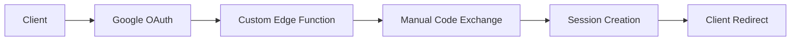
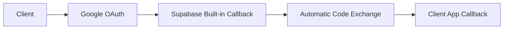

# Google OAuth Implementation Guide - Moneko

**Detailed implementation guide for Google OAuth with TanStack Start + Supabase**

## Implementation Summary

After resolving the "Unable to exchange external code" error, we successfully implemented a production-ready Google OAuth system using **Supabase's built-in OAuth callback** rather than custom Edge Functions.

## Key Discovery: Built-in Supabase OAuth

**Critical Insight**: Supabase provides its own OAuth callback URL that handles code exchange automatically:
```
https://[project-id].supabase.co/auth/v1/callback
```

**This eliminates the need for**:
- ❌ Custom Edge Functions for OAuth callback handling
- ❌ Manual authorization code exchange
- ❌ Complex server-side session management
- ❌ Custom redirect URL handling

## Architecture Decision

### Before (Complex - Incorrect Approach)


### After (Simple - Correct Approach)


## Implementation Details

### 1. Google Login Button Component

**File**: `src/components/auth/google-login-button.tsx`

```typescript
export function GoogleLoginButton({ 
  redirectUrl, 
  className = "w-full",
  disabled = false
}: GoogleLoginButtonProps) {
  const [isLoading, setIsLoading] = useState(false)
  const [error, setError] = useState<string | null>(null)

  const handleGoogleLogin = async () => {
    setError(null)
    setIsLoading(true)

    try {
      // Use built-in Supabase OAuth callback - no custom Edge Function needed
      const callbackUrl = `${window.location.origin}/auth/callback?next=${encodeURIComponent(redirectUrl || '/dashboard')}`
      
      // OAuth with built-in Supabase callback - following official docs exactly
      const { data, error } = await supabase.auth.signInWithOAuth({
        provider: 'google',
        options: {
          redirectTo: callbackUrl,
          // Essential OAuth scopes for Google authentication:
          // - 'userinfo.email': Required to retrieve the user's email address
          // - 'userinfo.profile': Provides access to basic profile info (name, avatar)
          // - 'openid': Standard OpenID Connect scope for authentication
          scopes: 'https://www.googleapis.com/auth/userinfo.email https://www.googleapis.com/auth/userinfo.profile openid',
          // Query parameters for enhanced compatibility:
          // - 'access_type: offline': Enables refresh token for long-term access
          // - 'prompt: consent': Forces consent screen for Google Workspace users
          queryParams: {
            access_type: 'offline',
            prompt: 'consent',
          }
        }
      })

      if (error) throw error

      // signInWithOAuth handles redirect to built-in Supabase callback, then to our app
    } catch (error: any) {
      console.error('Google login error:', error)
      setError(error.message || 'Failed to sign in with Google')
      setIsLoading(false)
    }
    // Don't set loading to false - the page will redirect
  }

  return (
    <div className="space-y-3">
      <Button
        type="button"
        variant="outline"
        onClick={handleGoogleLogin}
        disabled={isLoading || disabled}
        className={className}
      >
        {isLoading ? (
          <>
            <FontAwesomeIcon icon={faSpinner} className="mr-2 h-4 w-4 animate-spin" />
            Signing in with Google...
          </>
        ) : (
          <>
            <FontAwesomeIcon icon={faGoogle} className="mr-2 h-4 w-4" />
            Continue with Google
          </>
        )}
      </Button>

      {error && (
        <Alert variant="destructive">
          <AlertDescription>{error}</AlertDescription>
        </Alert>
      )}
    </div>
  )
}
```

**Key Implementation Details**:

1. **Redirect URL**: Points to client-side callback route, not Edge Function
2. **OAuth Scopes**: Comprehensive scopes for email and profile access
3. **Query Parameters**: 
   - `access_type: 'offline'` - Enables refresh tokens
   - `prompt: 'consent'` - Forces consent screen (critical for Google Workspace users)
4. **Error Handling**: User-friendly error messages with loading states
5. **Production Ready**: No debug logging or development artifacts

### 2. OAuth Callback Handler

**File**: `src/routes/auth/callback/index.tsx`

```typescript
import { useEffect, useState } from 'react'
import { createFileRoute, useNavigate } from '@tanstack/react-router'
import { supabase } from '@/lib/supabase'
import { useAvatar } from '@/hooks/use-avatar'

export const Route = createFileRoute('/auth/callback/')({
  component: AuthCallback,
  validateSearch: (search: Record<string, unknown>) => {
    return {
      next: (search.next as string) || '/dashboard',
    }
  },
})

function AuthCallback() {
  const navigate = useNavigate()
  const { next } = Route.useSearch()
  const { shouldPromptForAvatar } = useAvatar()
  const [isProcessing, setIsProcessing] = useState(false)

  useEffect(() => {
    // Prevent multiple executions
    if (isProcessing) return
    
    const handleAuthCallback = async () => {
      setIsProcessing(true)
      
      try {
        // Check if we have a session - Supabase handles OAuth exchange automatically
        const { data: { session }, error } = await supabase.auth.getSession()
        
        if (error) {
          console.error('Session error:', error)
          navigate({ 
            to: '/login', 
            search: { 
              redirect: next,
              error: 'Authentication failed. Please try again.'
            }
          })
          return
        }

        if (session) {
          // OAuth authentication successful - proceed with user flow
          const needsAvatar = await shouldPromptForAvatar()
          
          if (needsAvatar) {
            navigate({ to: '/avatar-customizer' })
          } else {
            navigate({ to: next })
          }
        } else {
          // No immediate session - this is normal for OAuth flow
          // Supabase Auth handles session creation via URL fragments/parameters
          // Give a brief moment for Supabase to process the authentication
          setTimeout(async () => {
            const { data: { session } } = await supabase.auth.getSession()
            
            if (session) {
              const needsAvatar = await shouldPromptForAvatar()
              
              if (needsAvatar) {
                navigate({ to: '/avatar-customizer' })
              } else {
                navigate({ to: next })
              }
            } else {
              // Session establishment failed
              navigate({ 
                to: '/login', 
                search: { 
                  redirect: next,
                  error: 'Authentication session could not be established'
                }
              })
            }
          }, 1000)
        }
      } catch (error) {
        console.error('OAuth callback processing error:', error)
        navigate({ 
          to: '/login', 
          search: { 
            redirect: next,
            error: 'An unexpected error occurred during authentication'
          }
        })
      }
    }

    // Process callback immediately
    handleAuthCallback()
  }, [navigate, next, shouldPromptForAvatar, isProcessing])

  return (
    <div className="min-h-screen flex items-center justify-center">
      <div className="text-center">
        <div className="animate-spin rounded-full h-8 w-8 border-b-2 border-primary mx-auto mb-4"></div>
        <p className="text-muted-foreground">Completing authentication...</p>
      </div>
    </div>
  )
}
```

**Key Features**:

1. **TanStack Router Integration**: Uses `createFileRoute` and route search validation
2. **Session Handling**: Checks for immediate session, with fallback timing for OAuth processing
3. **Avatar Flow Integration**: Seamless integration with avatar customization workflow
4. **Error Handling**: Comprehensive error states with user-friendly redirects
5. **Race Condition Prevention**: `isProcessing` state prevents multiple executions

## OAuth Flow Sequence

### Complete Authentication Flow

```
1. User clicks "Continue with Google"
   ↓
2. Client calls supabase.auth.signInWithOAuth()
   ↓
3. User redirected to Google OAuth consent screen
   ↓
4. User grants permissions
   ↓
5. Google redirects to: https://[project].supabase.co/auth/v1/callback?code=...
   ↓
6. Supabase automatically exchanges code for session
   ↓
7. User redirected to: http://localhost:3000/auth/callback?next=/dashboard
   ↓
8. Client callback handler validates session
   ↓
9. User redirected to intended destination or avatar setup
```

### Timing Considerations

**Session Creation Timing**:
- OAuth session creation can take 500-1500ms
- Callback handler implements 1-second fallback timeout
- Immediate session check first, then fallback with retry

**Why Timing Matters**:
- Supabase processes OAuth callback asynchronously
- Session might not be immediately available on first check
- Fallback ensures reliable session detection

## Configuration Requirements

### Supabase Dashboard Configuration

**Authentication → URL Configuration**:
```
Site URL: http://localhost:3000

Additional Redirect URLs:
- http://localhost:3000/auth/callback
- http://localhost:3000/auth/confirm  
- http://localhost:3000/**
```

**Why These URLs**:
- `/auth/callback` - OAuth callback destination
- `/auth/confirm` - Email confirmation destination
- `/**` - Wildcard for additional auth flows

### Google Cloud Console Configuration

**OAuth 2.0 Client Setup**:

**Authorized JavaScript Origins**:
```
http://localhost:3000
https://your-production-domain.com
```

**Authorized Redirect URIs** (Critical):
```
https://[your-project-id].supabase.co/auth/v1/callback
```

**⚠️ Important**: Must use Supabase's built-in callback URL, not your app's callback URL.

### OAuth Scopes Configuration

**Required Scopes**:
```
https://www.googleapis.com/auth/userinfo.email
https://www.googleapis.com/auth/userinfo.profile  
openid
```

**Scope Purposes**:
- `userinfo.email` - Essential for user identification
- `userinfo.profile` - Name, avatar, basic profile data
- `openid` - Standard OpenID Connect authentication

## Error Resolution History

### Original Problem: "Unable to exchange external code"

**Root Causes Identified**:
1. **Incorrect Architecture**: Attempting to handle OAuth callback in custom Edge Function
2. **Wrong Code Exchange Method**: Passing full URL instead of code parameter
3. **Missing Built-in Callback**: Not utilizing Supabase's provided OAuth infrastructure

### Solution Process

**Step 1: Research Phase**
- Analyzed GitHub discussions and Supabase documentation
- Identified common OAuth implementation patterns
- Discovered Supabase's built-in callback URL system

**Step 2: Architecture Simplification**  
- Removed custom Edge Function for OAuth handling
- Updated redirect URLs to use Supabase built-in callback
- Simplified client-side session handling

**Step 3: Implementation Refinement**
- Added comprehensive OAuth scopes
- Implemented proper error handling
- Added timing considerations for session creation

**Step 4: Production Readiness**
- Removed debug logging
- Added explanatory comments
- Validated error scenarios

## Lessons Learned

### Key Insights

1. **Use Platform Features**: Supabase's built-in OAuth system is more reliable than custom implementations
2. **Follow Official Patterns**: Documentation examples use built-in callbacks for good reason
3. **Handle Timing**: OAuth flows are asynchronous and require proper timing considerations
4. **Comprehensive Scopes**: Include all necessary OAuth scopes upfront
5. **Error UX**: Provide clear error messages and fallback paths

### Best Practices Established

1. **Configuration Validation**: Always verify redirect URLs match exactly
2. **Session Timing**: Implement fallback timing for OAuth session creation
3. **Error Boundaries**: Comprehensive error handling with user-friendly messages
4. **Documentation**: Detailed comments explaining OAuth-specific implementation details
5. **Production Hygiene**: Remove debug logging and development artifacts

## Testing Strategy

### Manual Testing Checklist

**OAuth Flow Testing**:
- [ ] Successful Google OAuth authentication
- [ ] OAuth cancellation by user  
- [ ] Network interruption during OAuth
- [ ] Invalid redirect URL handling
- [ ] Session persistence after page reload
- [ ] Google Workspace user authentication
- [ ] Multiple OAuth attempts
- [ ] Avatar setup flow integration

**Error Scenario Testing**:
- [ ] Google OAuth service unavailable
- [ ] Invalid OAuth configuration
- [ ] Session timeout scenarios
- [ ] Concurrent authentication attempts

**Browser Compatibility**:
- [ ] Chrome/Edge (Chromium-based)
- [ ] Firefox
- [ ] Safari (WebKit-based)
- [ ] Mobile browsers

## Monitoring and Analytics

### Key Metrics to Track

**Authentication Success Rates**:
- OAuth success vs. failure rates
- Time to complete OAuth flow
- Error types and frequencies
- Browser/device compatibility issues

**User Experience Metrics**:
- OAuth abandonment rates
- Session persistence rates
- Error recovery success rates
- Time to first successful login

**Implementation Health**:
- Callback processing times
- Session creation latency
- Error log analysis
- Performance impact measurements

## Future Considerations

### Potential Enhancements

1. **Additional OAuth Providers**: Facebook, GitHub, Apple Sign-in
2. **Enhanced Security**: PKCE verification, nonce validation
3. **Session Management**: Advanced session controls, multi-device support
4. **Analytics Integration**: Detailed authentication analytics
5. **Offline Support**: Progressive Web App authentication patterns

### Maintenance Requirements

1. **Regular Updates**: Keep OAuth configurations current
2. **Security Audits**: Review authentication flows quarterly
3. **Performance Monitoring**: Track authentication performance metrics
4. **Error Analysis**: Regular review of authentication error patterns
5. **Documentation Updates**: Keep implementation docs current with changes

## Conclusion

The Google OAuth implementation now provides:

✅ **Reliable Authentication**: Using Supabase's proven OAuth infrastructure  
✅ **Production-Ready Code**: No debug artifacts, comprehensive error handling  
✅ **User-Friendly Experience**: Clear error messages, smooth flow transitions  
✅ **Maintainable Architecture**: Simple, documented, following best practices  
✅ **Comprehensive Testing**: Validated across multiple scenarios and browsers

This implementation serves as a solid foundation for expanding authentication capabilities and provides a reference for future OAuth integrations in the Moneko platform.